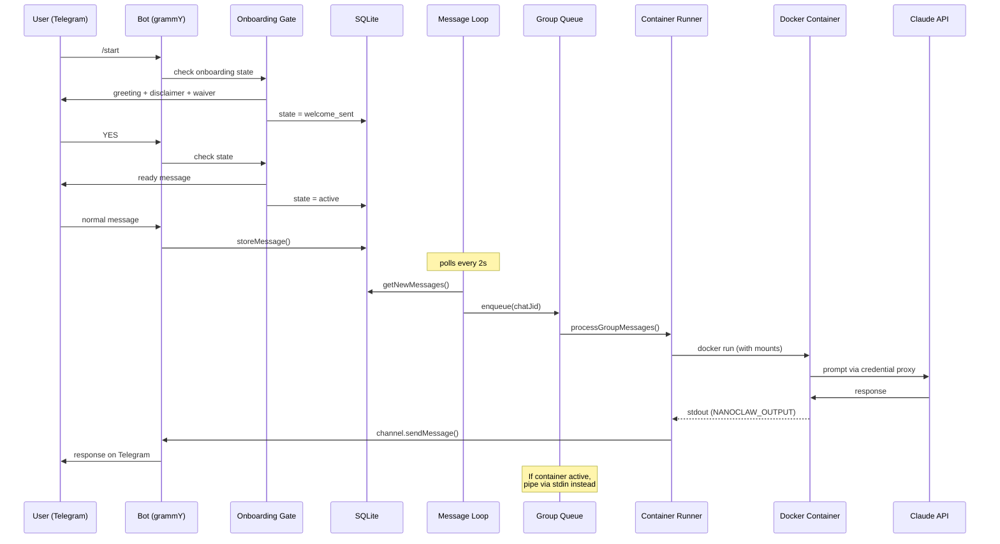
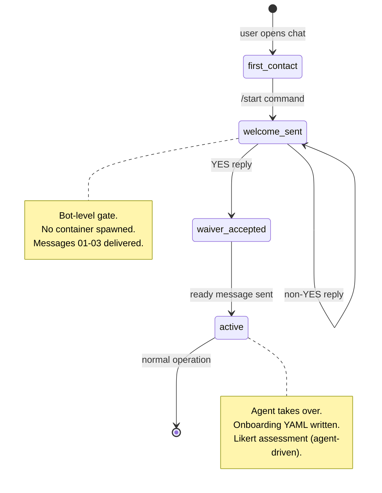
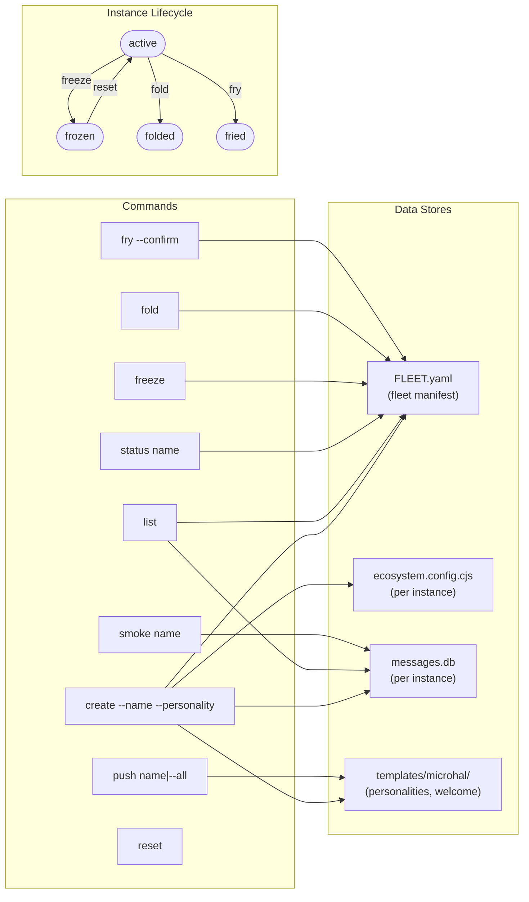
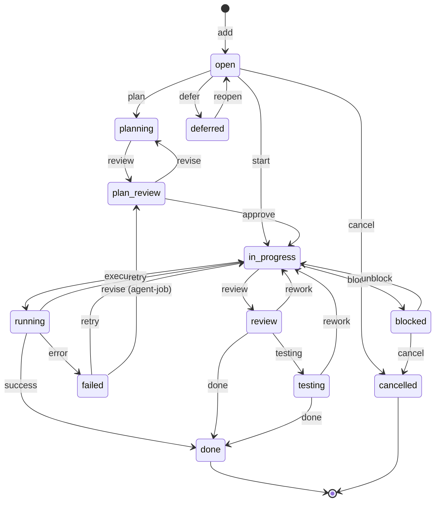
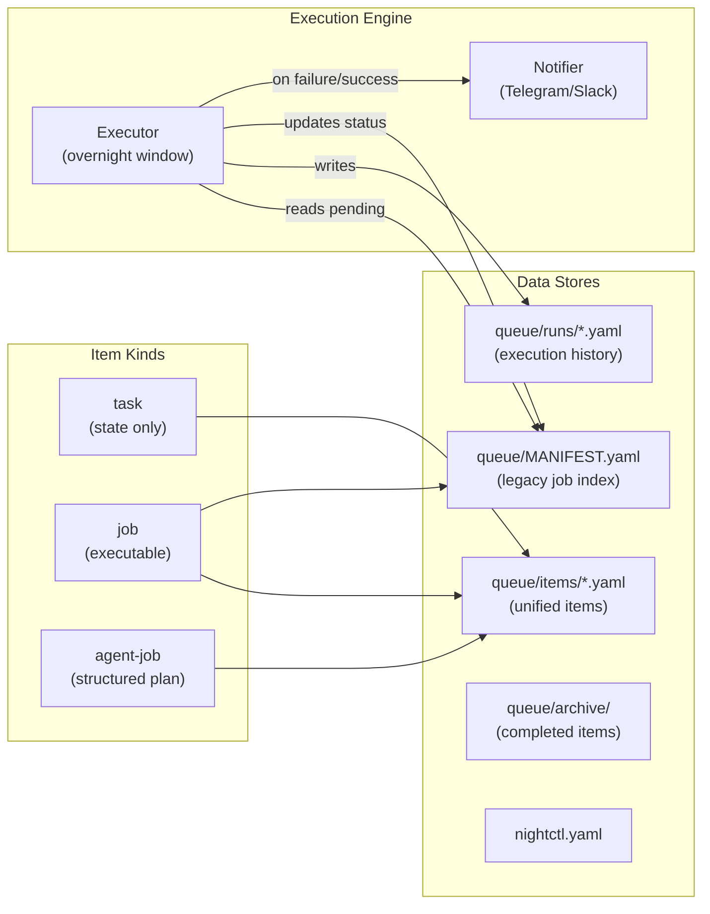

# Architecture Diagrams

> System as of 2026-03-18. Minted after fleet provisioning, onboarding system, and tier 2 smoke tests.

## 1. System Topology

```mermaid
graph TB
    subgraph Telegram["Telegram"]
        Rick["Rick (operator)"]
        Dad["Dad"]
        Mum["Mum"]
        Ben["Ben"]
    end

    subgraph Server["Linux Server (ryz7n)"]
        subgraph Prime["HAL-prime — systemd"]
            TG1["@minano_tbot"]
            Pool["Bot Pool (4 swarm bots)"]
            Proxy1["Credential Proxy :3001"]
            DB1[(SQLite)]
        end

        subgraph Fleet["halfleet/"]
            subgraph Ben_inst["microhal-ben — pm2"]
                TG2["@hal_micro_ben_1_bot"]
                Proxy2["Proxy :3002"]
                DB2[(SQLite)]
            end
            subgraph Dad_inst["microhal-dad — pm2"]
                TG3["@HALCaptain_bot"]
                Proxy3["Proxy :3874"]
                DB3[(SQLite)]
            end
            subgraph Mum_inst["microhal-mum — pm2"]
                TG4["@HALMum_bot"]
                Proxy4["Proxy :3751"]
                DB4[(SQLite)]
            end
        end

        Docker["Docker Engine"]
    end

    subgraph Anthropic["Anthropic API"]
        API["Claude API"]
    end

    Rick -->|messages| TG1
    Rick -->|testing| TG2 & TG3 & TG4
    Ben -->|messages| TG2
    Dad -->|messages| TG3
    Mum -->|messages| TG4

    Prime -->|spawn containers| Docker
    Ben_inst -->|spawn containers| Docker
    Dad_inst -->|spawn containers| Docker
    Mum_inst -->|spawn containers| Docker

    Docker -->|ANTHROPIC_BASE_URL| Proxy1
    Proxy1 -->|authenticated| API

    style Fleet fill:#1a1a2e,stroke:#16213e
    style Prime fill:#0f3460,stroke:#533483
    style Docker fill:#2c2c54,stroke:#474787
```



## 2. Message Flow



## 3. Fleet Provisioning Pipeline

```mermaid
flowchart TD
    Create["halctl create --name X"]
    Copy["Copy prime source tree<br/>(exclude: store/, memory/, groups/, .env*)"]
    Templates["Compose CLAUDE.md<br/>(base + personality blocks + user context)"]
    Build["npm install + npm run build"]
    Lock["Lock governance<br/>(chmod 444/555: CLAUDE.md, .claude/, src/, halos/)"]
    Exempt["Exempt cpSync paths<br/>(.claude/skills → 755)"]
    Register["Register operator chat<br/>(tg:5967394003 → main group)"]
    Ecosystem["Generate ecosystem.config.cjs<br/>(hardcode bot token, proxy ports)"]
    Manifest["Append to FLEET.yaml"]
    Start["pm2 start"]

    Create --> Copy --> Templates --> Build --> Lock --> Exempt
    Exempt --> Register --> Ecosystem --> Manifest --> Start

    Push["halctl push X"]
    PushCopy["Copy locked files from prime"]
    PushBuild["Rebuild TypeScript"]
    PushClaude["Recompose CLAUDE.md"]
    PushLock["Re-lock governance"]

    Push --> PushCopy --> PushBuild --> PushClaude --> PushLock

    Smoke["halctl smoke X"]
    Infra["Infrastructure checks<br/>(pm2, DB, schema, proxy, permissions)"]
    Agent["Agent capability checks<br/>(respond, file read, tool use, memory write)"]

    Smoke --> Infra --> Agent

    style Create fill:#0f3460,stroke:#533483
    style Push fill:#16213e,stroke:#0f3460
    style Smoke fill:#1a1a2e,stroke:#16213e
```



## 4. Container Mount Map

```mermaid
graph LR
    subgraph Host["Host Filesystem"]
        PR["~/code/nanoclaw"]
        MEM["~/code/nanoclaw/memory"]
        GRP["~/code/nanoclaw/groups/telegram_main"]
        IPC["~/code/nanoclaw/data/ipc/telegram_main"]
        FLT["~/code/halfleet/"]
        ENV["~/code/nanoclaw/.env"]
    end

    subgraph Container["Docker Container"]
        WP["/workspace/project"]
        WPM["/workspace/project/memory"]
        WG["/workspace/group"]
        WI["/workspace/ipc"]
        WF["/workspace/fleet"]
        WE["/workspace/project/.env"]
    end

    PR -->|"rw (prime main)<br/>ro (fleet/non-main)"| WP
    MEM -->|rw| WPM
    GRP -->|rw| WG
    IPC -->|rw| WI
    FLT -->|"ro (prime main only)"| WF
    ENV -->|"/dev/null shadow"| WE

    style WP fill:#0f3460
    style WF fill:#1a1a2e
    style WE fill:#c0392b
```



## 5. Onboarding State Machine



## 6. halctl — Fleet Management



## 7. memctl — Structured Memory

```mermaid
flowchart TB
    subgraph Commands
        new["new --title --type<br/>--tags --body"]
        search["search --tags<br/>--entities --text"]
        link["link --from --to"]
        enrich["enrich<br/>(propose links)"]
        prune["prune --execute"]
        graph["graph --format html"]
        index["index rebuild|verify"]
    end

    subgraph Stores["Data Stores"]
        NOTES["memory/notes/*.md<br/>(frontmatter + body)"]
        INDEX["memory/INDEX.md<br/>(JSON index)"]
        ARCHIVE["memory/archive/<br/>(pruned notes)"]
        CONFIG["memctl.yaml"]
    end

    new -->|create note + update index| NOTES & INDEX
    search -->|query| INDEX
    link -->|add backlink| NOTES
    link -->|increment backlink_count| INDEX
    enrich -->|semantic analysis| INDEX
    prune -->|score < threshold| ARCHIVE
    prune -->|remove from| NOTES & INDEX
    graph -->|render| INDEX
    index -->|rebuild from| NOTES

    subgraph NoteLifecycle["Note Lifecycle"]
        direction LR
        created(["created"])
        active2(["active"])
        stale(["stale"])
        archived(["archived"])
        created -->|backlinked| active2
        active2 -->|low score| stale
        stale -->|prune| archived
        active2 -->|high backlinks| active2
    end
```

## 8. nightctl — Work Tracker




