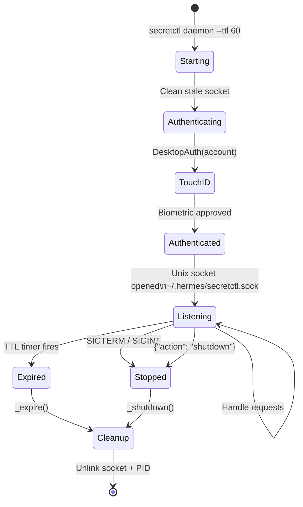
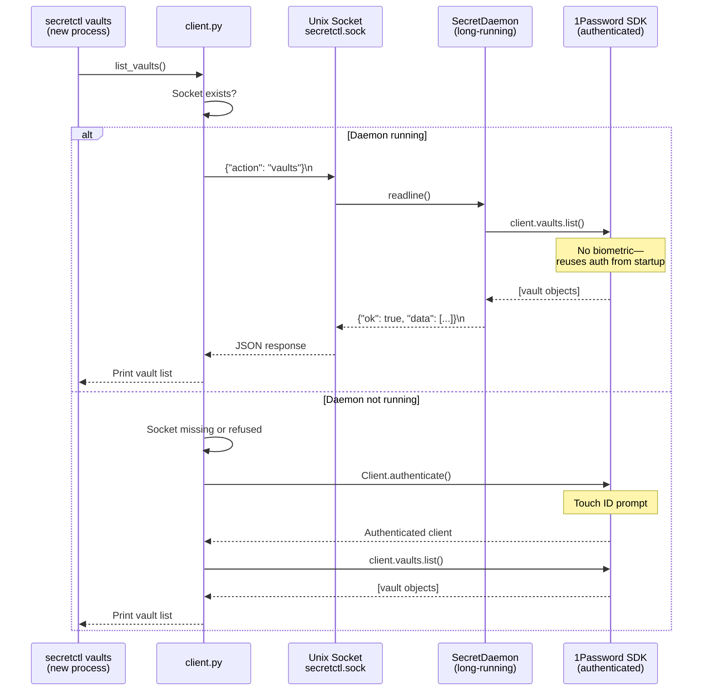
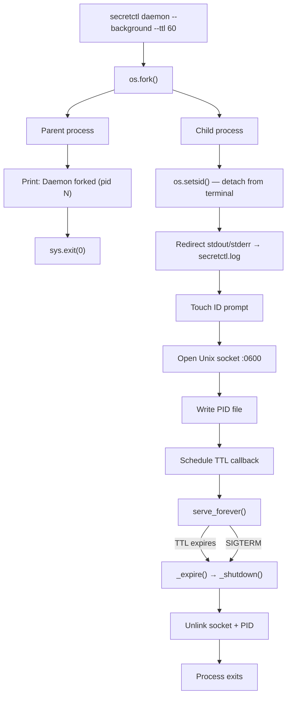
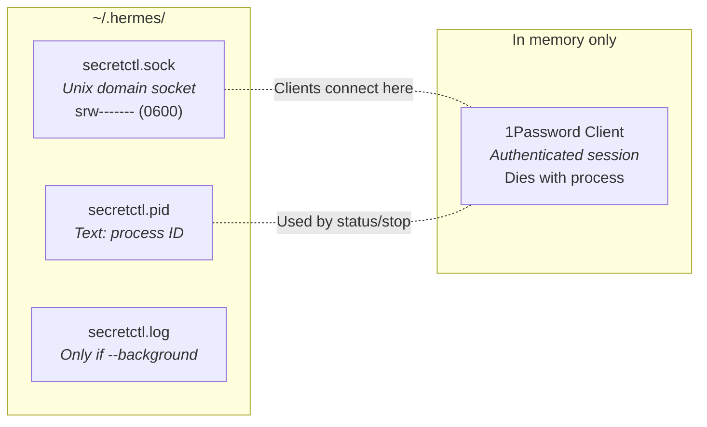
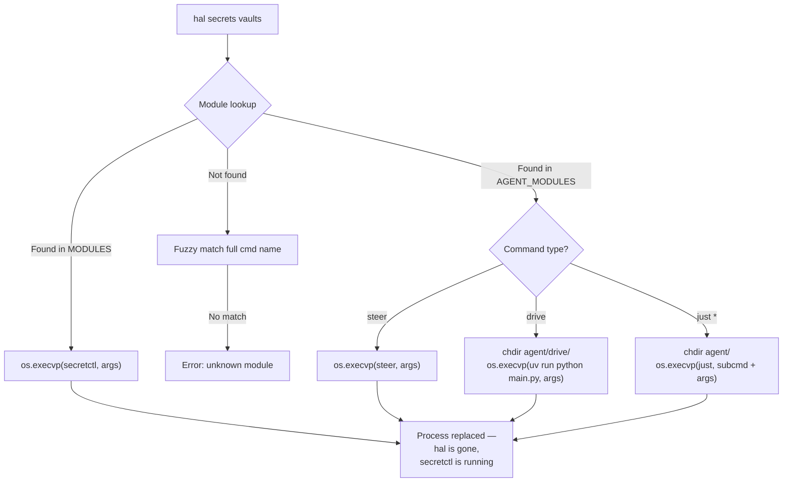

# secretctl Architecture

> Verified: 2026-03-28
> Source: `halos/secretctl/` (client.py, daemon.py, cli.py)

secretctl gives halos modules and agents access to 1Password secrets without repeated biometric prompts. A long-running daemon authenticates once via Touch ID, then serves secrets to any local process over a Unix socket for the duration of its TTL.

---

## Daemon Lifecycle

The daemon moves through a linear sequence: authenticate, listen, shut down. There are no restart or reconnect states — if it dies, the next client that needs a secret either starts a new daemon or falls back to direct SDK auth.



**Starting:** Removes any stale socket file left by a previous crash. Without this, `asyncio.start_unix_server()` would fail with "address already in use."

**Authenticating:** The 1Password Python SDK's `DesktopAuth` communicates with the 1Password desktop app over IPC. The desktop app handles the biometric challenge. The SDK receives an authenticated session object — no tokens are written to disk.

**Listening:** The daemon enters `serve_forever()`, an asyncio coroutine that blocks until the server is explicitly closed. Three things can trigger shutdown: the TTL timer (registered via `loop.call_later`), a Unix signal, or a `{"action": "shutdown"}` request from a client.

**Cleanup:** Unlinks both `secretctl.sock` and `secretctl.pid`. The `finally` block in `run()` calls `_cleanup()` as a safety net in case `_shutdown()` was interrupted.

---

## Request Flow

Every CLI invocation (e.g. `secretctl vaults`) is a new short-lived process. `client.py` checks whether the daemon is reachable before deciding how to authenticate.



**Protocol:** Newline-delimited JSON over a Unix domain socket. One JSON object per line, request and response. No HTTP, no framing, no overhead. The connection supports multiple request/response cycles (the daemon reads in a `while True` loop), but in practice each client sends one request and disconnects.

**Fallback:** `_daemon_request()` checks three things: does the socket file exist, can we connect, does the response arrive within 10 seconds. Any failure returns `None`, and the caller falls through to direct SDK authentication. This means the daemon is always optional — secretctl works without it, just with more fingerprint prompts.

**Why the SDK doesn't re-prompt:** The `Client` object holds the authenticated session as an in-memory state machine. Every `.secrets.resolve()` or `.vaults.list()` call is a method invocation on that live object, routed through the SDK's internal IPC to the 1Password desktop app. The desktop app remembers that this process was already authorised. No re-authentication until the process dies.

---

## Background Daemon (fork)

With `--background`, the daemon detaches from the terminal so it survives shell exits. This uses the classic Unix double-fork pattern (simplified to a single fork since we call `os.setsid()`).



**`os.fork()`:** Creates an identical copy of the process. The parent gets the child's PID (positive integer); the child gets 0. Both continue executing from the same point.

**`os.setsid()`:** The child becomes a session leader — it's no longer associated with the terminal that started it. Closing that terminal won't send SIGHUP to the daemon.

**Stdout/stderr redirect:** Since there's no terminal, output goes to `~/.hermes/secretctl.log`. The `open()` + `os.dup2()` pattern replaces file descriptors 1 (stdout) and 2 (stderr) at the OS level, so even C libraries writing to stderr end up in the log file.

**Touch ID timing:** The biometric prompt appears *after* the parent has exited and returned you to the shell. This can be slightly confusing — your terminal prompt is back, but Touch ID is waiting. The daemon won't start serving until you approve.

---

## What's on Disk

Nothing sensitive is persisted. The authenticated session exists only in the daemon process's memory. Kill the process and the auth is gone.



| File | Purpose | Lifecycle |
|---|---|---|
| `secretctl.sock` | Unix domain socket. Clients connect here to send JSON requests. | Created on startup, unlinked on shutdown. Permission `0600` — only the owning user can connect. |
| `secretctl.pid` | Contains the daemon's process ID as plain text. | Created on startup, unlinked on shutdown. Used by `is_running()` to check liveness via `os.kill(pid, 0)`. |
| `secretctl.log` | Daemon stdout/stderr when running with `--background`. | Appended to, never truncated automatically. Only exists if you've used `--background`. |

**Stale file recovery:** If the daemon crashes without cleaning up, the next `start_daemon()` call detects the stale PID (process no longer exists), removes both files, and starts fresh. `is_running()` handles this transparently.

---

## hal Dispatcher

`hal` is a thin router that replaces itself with the target command via `os.execvp()`. After the exec call, the hal process no longer exists — the kernel has replaced its entire memory image with the target binary. No subprocess overhead, no parent process lingering.



**`os.execvp` vs `subprocess.run`:** `execvp` replaces the current process. There's no parent waiting for a child — hal becomes secretctl. This means exit codes, signals, and stdio all pass through natively. `subprocess.run` would create a child process and require hal to forward everything, adding complexity for no benefit.

**Agent tool dispatch:** Commands prefixed with `just` need to run from the `agent/` directory (the justfile lives there). `os.chdir()` before `execvp` handles this. `drive` similarly needs to run from `agent/drive/` since it's a separate uv project with its own `pyproject.toml`.

**Fuzzy matching:** If someone types `hal nightctl add` instead of `hal night add`, the fuzzy matcher strips the `ctl` suffix and finds the alias. This catches the common case of using the full command name as the module identifier.

---

## CLI Quick Reference

```bash
# Daemon management
secretctl daemon                        # foreground, 30 min TTL
secretctl daemon --background --ttl 60  # background, 1 hour
secretctl status                        # check if running
secretctl stop                          # graceful shutdown

# Secret access (routes through daemon if running)
secretctl vaults                        # list vaults
secretctl items <vault_id>              # list items
secretctl get <vault_id> <item_id>      # full item with fields
secretctl resolve "op://Vault/Item/field"              # single secret
secretctl resolve ref1 ref2 ref3 --json                # batch, JSON

# Via hal
hal secrets daemon --ttl 120
hal secrets resolve "op://Personal/eBay/password"

# Programmatic (from other halos modules)
from halos.secretctl.client import resolve
password = await resolve("op://Personal/eBay/password")
```

## Security Notes

- The Unix socket is `0600` — only the owning user can connect. No network exposure.
- No secrets are cached on disk. The authenticated session lives in process memory only.
- The TTL guarantees the daemon won't run indefinitely if forgotten.
- The 1Password desktop app's own security model still applies — the SDK session is scoped to what the desktop app permits.
- The daemon logs (`secretctl.log`) contain status messages, not secret values. Responses containing secrets are only written to the socket, never to the log.
