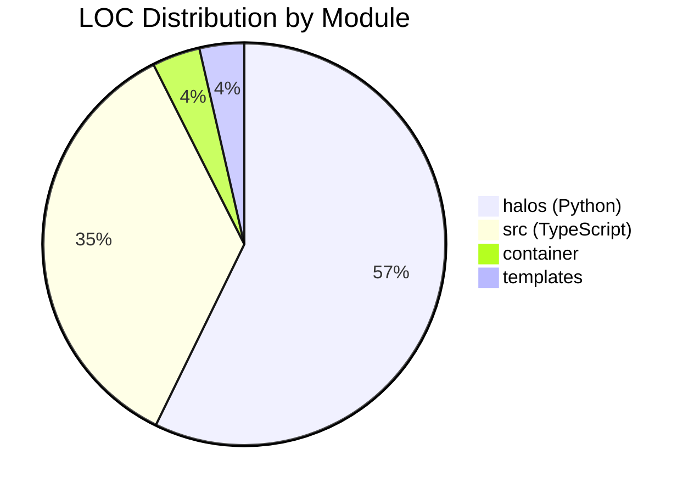
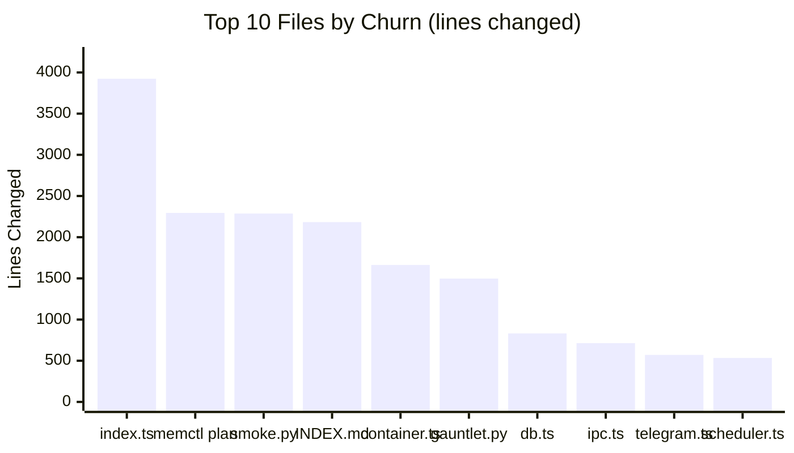

# 001 — Codebase Census

*2026-03-20 — Baseline measurement before systematic walkthrough*

## Summary

~29,000 LOC across three codebases: nanoclaw core (TypeScript), halos tooling (Python), and the container agent runner (TypeScript). Plus ~1,100 lines of templates.



## Module Sizes

### nanoclaw core (`src/`) — ~10,610 LOC

| File | LOC | Role |
|------|-----|------|
| `channels/telegram.test.ts` | 953 | Telegram channel tests |
| [`container-runner.ts`](004-container-runner.md) | 833 | Spawns agent containers with mounts |
| [`db.ts`](005-data-layer.md) | 773 | SQLite: messages, sessions, onboarding, assessments |
| `ipc-auth.test.ts` | 678 | IPC auth tests |
| [`index.ts`](003-orchestrator.md) | 755 | Orchestrator: state, message loop, agent invocation |
| [`channels/telegram.ts`](006-channels.md) | 582 | Telegram channel: polling, onboarding, welcome |
| `group-queue.test.ts` | 484 | Group queue tests |
| `db.test.ts` | 484 | DB tests |
| [`ipc.ts`](002-connective-tissue.md) | 465 | IPC watcher and task processing |
| [`mount-security.ts`](007-security.md) | 419 | Filesystem mount security |
| `remote-control.test.ts` | 392 | Remote control tests |
| [`group-queue.ts`](002-connective-tissue.md) | 430 | Per-group message queueing |
| [`channels/gmail.ts`](006-channels.md) | 374 | Gmail channel |
| [`task-scheduler.ts`](002-connective-tissue.md) | 282 | Scheduled task runner |
| `formatting.test.ts` | 256 | Formatting tests |
| [`credential-proxy.ts`](007-security.md) | 251 | Credential proxy for containers |
| [`remote-control.ts`](007-security.md) | 218 | Remote control interface |
| Everything else | ~1,370 | Config, types, env, router, smaller modules |

**Test code:** ~3,900 LOC (38% of src/) — healthy ratio.

### halos (`halos/`) — ~17,200 LOC

| Module | LOC | Purpose |
|--------|-----|---------|
| [`halctl/`](009-halos-ecosystem.md) | 4,321 | Fleet management, provisioning, smoke tests, eval harness |
| [`nightctl/`](009-halos-ecosystem.md) | 2,452 | Work tracker: tasks, jobs, state machines |
| [`memctl/`](009-halos-ecosystem.md) | 1,167 | Structured memory governance |
| [`briefings/`](009-halos-ecosystem.md) | 818 | Cron-driven Telegram digests |
| [`logctl/`](009-halos-ecosystem.md) | 831 | Structured log reader and search |
| [`reportctl/`](009-halos-ecosystem.md) | 801 | Periodic digests |
| [`agentctl/`](009-halos-ecosystem.md) | 555 | LLM session tracking, spin detection |
| `todoctl/` | 673 | Todo management (predecessor to nightctl) |
| [`cronctl/`](009-halos-ecosystem.md) | 519 | Cron job definitions |
| [`trackctl/`](009-halos-ecosystem.md) | 728 | Personal metrics tracker |
| `halyt/` | 362 | Transcript analysis |
| `microhal/` | 279 | Onboarding system |
| `telemetry/` | 240 | Telemetry emission |
| `common/` | 39 | Shared logging |

**Largest single file:** `halctl/behavioral_smoke.py` at 2,287 LOC — the fleet behavioral smoke test suite.

### Container agent runner (`container/`) — 1,122 LOC

| File | LOC | Role |
|------|-----|------|
| [`agent-runner/src/index.ts`](002-connective-tissue.md) | 657 | Agent SDK runner inside container |
| [`agent-runner/src/ipc-mcp-stdio.ts`](002-connective-tissue.md) | 338 | MCP stdio bridge for IPC |
| `skills/agent-browser/SKILL.md` | 159 | Browser automation skill |
| `build.sh` | 24 | Container build script |

### Templates (`templates/`) — 1,079 LOC

Personality profiles, onboarding flows, assessment questions, governance blocks. ~60 files, mostly small configuration fragments. See [008 — Fleet & Personality](008-fleet-personality.md) for how these are consumed.

## Churn Heatmap (since Dec 2025)

Files ranked by total lines changed (additions + deletions). This shows where development energy has concentrated.

### Top 10 — Highest churn (excluding lock files and skills/)



| Churn | +/- | File | Signal |
|-------|-----|------|--------|
| 3,924 | +2,299 / -1,625 | [`src/index.ts`](003-orchestrator.md) | **Hottest file.** Orchestrator — constantly evolving |
| 2,294 | +2,294 / -0 | `docs/plans/2026-03-15-memctl.md` | Planning artifact |
| 2,287 | +2,287 / -0 | `halos/halctl/behavioral_smoke.py` | New, written in one pass |
| 2,183 | +2,044 / -139 | `memory/INDEX.md` | Memory index, auto-maintained |
| 1,663 | +1,222 / -441 | [`src/container-runner.ts`](004-container-runner.md) | Heavy iteration |
| 1,497 | +1,489 / -8 | `tests/test_e2e_gauntlet.py` | New, written in one pass |
| 832 | | [`src/db.ts`](005-data-layer.md) | Schema evolution |
| 714 | | [`src/ipc.ts`](002-connective-tissue.md) | IPC protocol changes |
| 571 | | [`src/channels/telegram.ts`](006-channels.md) | Channel development |
| 534 | | [`src/task-scheduler.ts`](002-connective-tissue.md) | Task scheduling |

### Interpretation

The **critical path** runs through three files:
1. **[`src/index.ts`](003-orchestrator.md)** (755 LOC, 3,924+ churn) — The orchestrator. Everything flows through here.
2. **[`src/container-runner.ts`](004-container-runner.md)** (833 LOC, 1,663+ churn) — How agents get spawned. High churn = still stabilising.
3. **[`src/db.ts`](005-data-layer.md)** (773 LOC, ~832+ churn) — Data layer. Schema has been evolving.

The **halos side** is more stable — most modules were written in focused passes and haven't churned much since. [`halctl`](009-halos-ecosystem.md) is the exception (fleet management is inherently complex).

## ROI Map for Manual Reading

Priority tiers based on LOC × churn × centrality:

```text
ROI Heatmap — Read Priority by Tier

  ████████████████████████████████████  TIER 1  ██  index.ts, container-runner.ts, agent-runner
  ██  HIGH ROI: ~2,220 LOC, highest churn, everything depends on these
  ██  Start here. No understanding without these three.
  ████████████████████████████████████

  ▓▓▓▓▓▓▓▓▓▓▓▓▓▓▓▓▓▓▓▓▓▓▓▓▓▓▓▓▓▓▓▓  TIER 2  ▓▓  db.ts, ipc.ts, telegram.ts, config.ts
  ▓▓  GOOD ROI: ~1,830 LOC, wiring layer, needed for operational work
  ▓▓  Read after Tier 1. Unlocks debugging and schema questions.
  ▓▓▓▓▓▓▓▓▓▓▓▓▓▓▓▓▓▓▓▓▓▓▓▓▓▓▓▓▓▓▓▓

  ░░░░░░░░░░░░░░░░░░░░░░░░░░░░░░░░  TIER 3  ░░  channels, security, fleet/personality
  ░░  MODERATE ROI: ~2,960 LOC, self-contained subsystems
  ░░  Read when relevant. Each stands alone.
  ░░░░░░░░░░░░░░░░░░░░░░░░░░░░░░░░

  ··································  TIER 4  ··  halos Python modules
  ··  LOW-URGENCY: ~16,471 LOC, large but mostly independent
  ··  Reference when needed. halctl is the exception (read early if managing fleet).
  ··································
```

### Tier 1 — Read these first (highest ROI)
- [`src/index.ts`](003-orchestrator.md) — The brain. Everything connects here.
- [`src/container-runner.ts`](004-container-runner.md) — How agents are born.
- [`container/agent-runner/src/index.ts`](002-connective-tissue.md) — What runs inside the container.

### Tier 2 — Read for operational understanding
- [`src/db.ts`](005-data-layer.md) — What gets stored, schema shape.
- [`src/ipc.ts`](002-connective-tissue.md) — How orchestrator and containers talk.
- [`src/channels/telegram.ts`](006-channels.md) — The primary channel implementation.
- [`src/config.ts`](002-connective-tissue.md) — All the knobs.

### Tier 3 — Read when relevant
- [`halos/halctl/cli.py` + `provision.py`](009-halos-ecosystem.md) — Fleet lifecycle.
- [`halos/nightctl/cli.py` + `item.py`](009-halos-ecosystem.md) — Work tracking.
- [`halos/memctl/cli.py`](009-halos-ecosystem.md) — Memory governance.
- [`halos/briefings/`](009-halos-ecosystem.md) — The briefing pipeline (gather → synthesise → deliver).

### Tier 4 — Reference only
- Test files (read alongside their source when exploring)
- [Templates](008-fleet-personality.md) (personality config, mostly declarative)
- Skills in `.claude/skills/` (upstream NanoClaw, high churn but formulaic)

## See also

- [002 — Connective Tissue](002-connective-tissue.md) — Tier 2 wiring: IPC, group queue, config, types, router
- [003 — Orchestrator](003-orchestrator.md) — Deep dive into `src/index.ts`
- [004 — Container Runner](004-container-runner.md) — Container spawning mechanics
- [005 — Data Layer](005-data-layer.md) — SQLite schema and `db.ts`
- [006 — Channels](006-channels.md) — Telegram, Gmail, and the registry
- [007 — Security](007-security.md) — Five-layer security model
- [008 — Fleet & Personality](008-fleet-personality.md) — Fleet provisioning and templates
- [009 — Halos Ecosystem](009-halos-ecosystem.md) — Python tooling modules
- [010 — Exploration Map](010-exploration-map.md) — Reading routes and session planning
