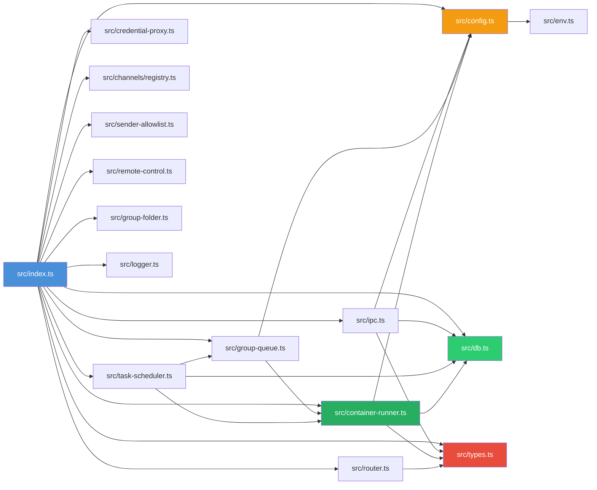
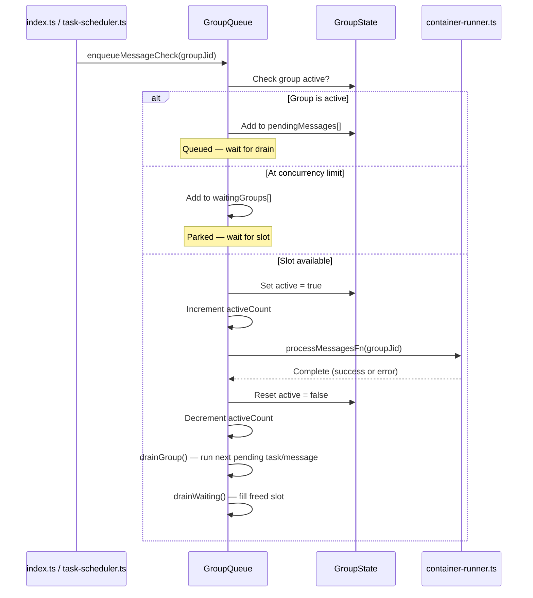

# 002 — The Connective Tissue

*2026-03-20 — Tier 2 breakdown: the files that wire the spine together*

## Overview

The spine ([001](001-codebase-census.md)) identified three files as the critical path: `src/index.ts`, `src/container-runner.ts`, `src/db.ts`. This entry maps the next layer — the files those three depend on to function. Understanding these is understanding how the system actually moves data.

## End-to-End Message Flow (Diagram)

The following diagram traces a single message through every file in the system:

```mermaid
flowchart TD
    A["1. User sends '@HAL ...' via Telegram"] --> B
    B["2. src/channels/telegram.ts\nPolling receives message\nCalls OnInboundMessage callback"]:::channel --> C
    C["3. src/index.ts\nStores message in SQLite via db.ts\nChecks TRIGGER_PATTERN from config.ts\nCalls groupQueue.enqueueMessageCheck()"]:::orchestrator --> D
    D["4. src/group-queue.ts\nContainer already running?\nAt MAX_CONCURRENT_CONTAINERS?\nIf clear: calls processMessagesFn()"]:::queue --> E
    E["5. src/index.ts — processMessages\nReads pending messages from db.ts\nFormats via router.ts → XML\nCalls container-runner.ts"]:::orchestrator --> F
    F["6. src/container-runner.ts\nBuilds Docker run command\nWrites ContainerInput to stdin\nParses OUTPUT markers from stdout"]:::container --> G
    G["7. container/agent-runner/src/index.ts\nParses stdin, builds prompt\nCalls SDK query() with MessageStream"]:::container --> H
    H["8. container/agent-runner/src/ipc-mcp-stdio.ts\nAgent calls tools → writes IPC files"]:::container --> I
    I["9. src/ipc.ts\nPolls data/ipc/{folder}/messages/\nAuthorization check\nRoutes through sendMessage callback"]:::ipc --> J
    J["10. src/router.ts\nrouteOutbound() finds Telegram channel\nChannel sends the response"]:::router --> K
    K["11. Container stays alive\nPolls for follow-up IPC messages\nEventually: _close or idle timeout\ngroup-queue.ts drains waiting groups"]:::queue

    classDef orchestrator fill:#4a90d9,color:#fff
    classDef channel fill:#7b68ee,color:#fff
    classDef queue fill:#e67e22,color:#fff
    classDef container fill:#27ae60,color:#fff
    classDef ipc fill:#e74c3c,color:#fff
    classDef router fill:#8e44ad,color:#fff
```



## File Dependency Graph

How the connective tissue files import each other:



## `src/types.ts` (108 LOC) — The Vocabulary

Everything speaks through five core types:

| Type | What it represents |
|------|-------------------|
| `RegisteredGroup` | A chat group the system knows about — name, folder, trigger pattern, permissions |
| `NewMessage` | An inbound message from any channel |
| `ScheduledTask` | A task in SQLite with cron/interval/once scheduling |
| `Channel` | Interface that Telegram/Gmail/etc implement (`connect`, `sendMessage`, `ownsJid`) |
| `ContainerConfig` | Mount configuration for a group's container |

**Key concept:** `isMain` on `RegisteredGroup` is the privilege boundary. The main group has elevated privileges — it can register new groups, schedule cross-group tasks, and refresh metadata. Everything else is sandboxed to its own folder. This single boolean is the authorization primitive for the entire system.

**Connections:** Used by every file in `src/`. The [`Channel`](#srctypests-108-loc--the-vocabulary) interface is what makes multi-channel routing possible — Telegram, Gmail, Slack all implement it, and [`router.ts`](#srcrouterts-52-loc--the-postman) dispatches to whichever channel owns a given JID. See [006-channels.md](006-channels.md) for channel implementations and [007-security.md](007-security.md) for how `isMain` shapes the security model.

## `src/config.ts` (94 LOC) — The Knobs

Pure configuration, no logic. Reads from `.env` via `readEnvFile()`, falls back to `process.env`.

### Notable values

| Constant | Default | What it controls |
|----------|---------|-----------------|
| `CONTAINER_TIMEOUT` | 30 min | Max container lifetime |
| `IDLE_TIMEOUT` | 30 min | How long to keep container alive after last result |
| `MAX_CONCURRENT_CONTAINERS` | 5 | Global concurrency cap |
| `IPC_POLL_INTERVAL` | 1s | Host-side IPC polling frequency |
| `SCHEDULER_POLL_INTERVAL` | 60s | How often to check for due tasks |
| `TRIGGER_PATTERN` | `^@HAL\b` | Regex built from `ASSISTANT_NAME` |
| `CONTAINER_PROXY_PORT` | 3001 | Port containers use for credential proxy; fleet instances override to route through prime |

**Design note:** Secrets (API keys, tokens) are explicitly NOT loaded here. They're handled solely by `credential-proxy.ts`, never exposed to containers. This is a deliberate security boundary — even if a container is compromised, it can't read raw credentials. See [007-security.md](007-security.md) for the full security model.

**Connections:** Imported by nearly every file. `TRIGGER_PATTERN` is used in [src/index.ts](003-orchestrator.md) to decide whether a message should wake the agent. `CONTAINER_PROXY_PORT` vs `CREDENTIAL_PROXY_PORT` distinction matters for fleet — see [008-fleet-personality.md](008-fleet-personality.md): fleet instances route their containers through prime's proxy.

## `src/ipc.ts` (465 LOC) — The Nervous System

File-based IPC between containers and the host process. Polled every second.

### Architecture

The IPC system uses the filesystem as a message bus between the host process and Docker containers:

```text
┌─────────────────────────────────┐         ┌─────────────────────────────────┐
│         HOST PROCESS            │         │       DOCKER CONTAINER          │
│                                 │         │                                 │
│  src/ipc.ts                     │         │  ipc-mcp-stdio.ts              │
│  ┌───────────────────────┐      │         │  ┌───────────────────────┐      │
│  │  pollIpc() — 1s loop  │      │         │  │  Agent calls MCP tool │      │
│  │                       │◄─────┼── read ─┼──│                       │      │
│  │  Reads JSON files     │      │         │  │  Writes JSON file     │      │
│  │  Deletes after read   │      │         │  │  (fire-and-forget)    │      │
│  └───────────┬───────────┘      │         │  └───────────────────────┘      │
│              │                  │         │                                 │
│              ▼                  │         │  ┌───────────────────────┐      │
│  ┌───────────────────────┐      │         │  │  Polls /workspace/    │      │
│  │  Dispatch:            │      │         │  │  ipc/input/ — 500ms   │◄─┐   │
│  │  • sendMessage        │──────┼─ write ─┼─►│                       │  │   │
│  │  • task CRUD          │      │         │  │  Follow-up messages   │  │   │
│  │  • register_group     │      │         │  └───────────────────────┘  │   │
│  └───────────────────────┘      │         │                             │   │
│                                 │         │  _close sentinel ───────────┘   │
└─────────────────────────────────┘         └─────────────────────────────────┘

  Shared filesystem mount:
  data/ipc/{groupFolder}/messages/*.json  ← container outbound (messages)
  data/ipc/{groupFolder}/tasks/*.json     ← container outbound (task CRUD)
  data/ipc/{groupFolder}/input/*.json     ← host inbound (follow-ups)
  data/ipc/{groupFolder}/input/_close     ← host → container shutdown signal
```

### Two namespaces

**Messages** (lines 68–125): Container wants to send a message to a chat.
- Authorization: main group can send anywhere; non-main can only send to its own JID.
- Special path for Telegram: if `data.sender` is set and JID starts with `tg:`, routes through `sendPoolMessage` (bot pool for multi-identity sending).

**Tasks** (lines 127–461): A large switch statement handling:
- `schedule_task` — creates a task in SQLite, with authorization (non-main can only target own group)
- `pause_task` / `resume_task` / `cancel_task` — status mutations, authorized by group folder match
- `update_task` — partial updates with schedule recomputation
- `refresh_groups` — main-only, triggers group metadata sync
- `register_group` — main-only, adds a new group to the system (with folder name validation)

### Dependency injection

The `IpcDeps` interface lets [src/index.ts](003-orchestrator.md) provide the actual implementations:
- `sendMessage` — route through [channels](006-channels.md)
- `registeredGroups` — current group registry
- `registerGroup` — add a new group
- `syncGroups` — refresh metadata from channels
- `getAvailableGroups` / `writeGroupsSnapshot` — provide group lists to containers

**Why file-based IPC?** Files work across Docker's isolation boundary without exposing ports. It's simple, atomic (write-then-rename), and survives crashes. The tradeoff is latency — minimum 1s polling interval. See [004-container-runner.md](004-container-runner.md) for the container side of this boundary.

**Connections:** Called from [src/index.ts](003-orchestrator.md) (starts the watcher). Depends on [src/db.ts](005-data-layer.md) for task CRUD. Depends on `src/config.ts` for paths and intervals. The container-side counterpart is `ipc-mcp-stdio.ts`.

## `src/group-queue.ts` (430 LOC) — The Traffic Controller

Manages container concurrency across groups. This is the scheduler that decides *when* containers run.

### Key invariants

1. **One container per group at a time.** Messages arriving while a container runs are queued.
2. **Global cap** of `MAX_CONCURRENT_CONTAINERS` (5). Excess groups wait in `waitingGroups[]`.
3. **Tasks before messages** when draining — tasks won't be re-discovered from SQLite, messages will.
4. **Idle containers can be preempted** — if a container is idle-waiting and a task arrives, `closeStdin()` writes a `_close` sentinel to wind it down.

### Container lifecycle (from GroupQueue's perspective)



### Follow-up message delivery

`sendMessage(groupJid, text)` writes a JSON file to `data/ipc/{groupFolder}/input/`, which the container polls. This is how messages reach an already-running container without restarting it. The cursor (`lastAgentTimestamp`) is **not** advanced on pipe (RESP.IPC.01) — if the process crashes before the container drains the file, restart recovery re-fetches these messages from SQLite.

### Retry logic

Exponential backoff: base 5s, doubling, max 5 retries. After max retries, schedules a recovery check (GQ.RETRY.02) so stranded messages are eventually retried even if the conversation goes quiet.

### Graceful shutdown

`shutdown()` signals active containers to close via `_close` sentinel, waits up to `gracePeriodMs` for them to exit, then force-stops stragglers via `docker stop` (SVC.SHUT.01). This prevents the startup orphan cleanup from killing containers with in-flight responses.

**Connections:** Used by [src/index.ts](003-orchestrator.md) (creates the queue, provides `processMessagesFn`). Used by `src/task-scheduler.ts` (enqueues tasks). Manages `ChildProcess` references from [src/container-runner.ts](004-container-runner.md).

## `src/task-scheduler.ts` (282 LOC) — The Clock

Polls every 60 seconds for due tasks, enqueues them via GroupQueue.

### Task run lifecycle

1. `getDueTasks()` from SQLite (tasks where `next_run <= now` and `status = 'active'`)
2. For each: re-check status (may have been paused/cancelled since query)
3. `queue.enqueueTask()` with a closure that calls `runTask()`
4. `runTask()`:
   - Resolves group folder path (pauses task if invalid — stops retry churn for legacy rows)
   - Writes tasks snapshot for container to read
   - Calls `runContainerAgent()` with task prompt
   - Streams results back to user via `sendMessage`
   - Schedules container close after 10s (tasks are single-turn, no need for 30min idle)
   - Computes next run time
   - Logs run to `task_runs` table

### Drift prevention

`computeNextRun()` anchors to the scheduled time, not wall clock:
```typescript
let next = new Date(task.next_run!).getTime() + ms;
while (next <= now) next += ms;
```
This prevents cumulative drift on interval tasks — if a task runs 2s late, the next run isn't shifted by 2s.

**Connections:** Depends on [src/db.ts](005-data-layer.md) for task queries. Depends on [src/container-runner.ts](004-container-runner.md) for `runContainerAgent()`. Depends on `src/group-queue.ts` for concurrency. Called from [src/index.ts](003-orchestrator.md) at startup.

## `src/router.ts` (52 LOC) — The Postman

Small but structurally important. Three functions:

| Function | Purpose |
|----------|---------|
| `formatMessages()` | Wraps inbound messages in XML for agent prompts: `<message sender="..." time="...">text</message>` |
| `routeOutbound()` | Finds which channel owns a JID, sends through it. Throws if no channel matches. |
| `stripInternalTags()` | Removes `<internal>...</internal>` blocks from agent output before delivery |

**Design note:** The XML format for agent prompts is intentional — it gives the agent structured metadata (sender, timestamp) without requiring JSON parsing in the prompt.

**Connections:** Called by [src/index.ts](003-orchestrator.md) for both inbound formatting and outbound routing. `stripInternalTags` gives agents a way to "think out loud" without the output reaching users. Uses the [`Channel`](#srctypests-108-loc--the-vocabulary) interface from `src/types.ts` — see [006-channels.md](006-channels.md) for implementations.

## `container/agent-runner/src/index.ts` (657 LOC) — The Agent Brain

What actually runs inside the Docker container. This is the other side of the host/container boundary. See [004-container-runner.md](004-container-runner.md) for the host side.

### Input protocol

- **Stdin:** Full `ContainerInput` JSON (prompt, sessionId, groupFolder, chatJid, isMain, etc.)
- **IPC input:** Follow-up messages as JSON files in `/workspace/ipc/input/`, polled every 500ms
- **Close sentinel:** `/workspace/ipc/input/_close` — empty file whose existence signals "wind down"

### Output protocol

Results wrapped in `---NANOCLAW_OUTPUT_START---` / `---NANOCLAW_OUTPUT_END---` markers on stdout. Multiple results may be emitted (one per agent turn). The host's [container-runner.ts](004-container-runner.md) parses these markers.

### The query loop

```
parse stdin → build prompt (+ drain pending IPC)
→ while true:
    → runQuery(prompt, sessionId, mcpServerPath, ...)
    → SDK query() with MessageStream (async iterable)
    → poll IPC for follow-ups DURING the query
    → emit results via stdout markers
    → if _close during query → exit
    → emit session update
    → wait for next IPC message or _close
    → got message → loop with new prompt
    → got _close → exit
```

### MessageStream

A push-based async iterable that keeps the SDK's `isSingleUserTurn` false. This is important — it allows agent teams subagents to run to completion. Without it, the SDK would exit after a single turn.

### Spin detection (four layers)

1. **Rate limit on resume** (within 10 messages) → session poisoned, discard. Returns without `newSessionId` so host drops the session.
2. **Max turns without output** — 150 messages with 0 text results and no tool use → spinning, kill. Tool-heavy turns (subagent orchestration) get 3× the limit (450 messages) since tool calls indicate forward progress (AGR.SPIN.02).
3. **Query timeout** (RESP.BOUNDARY.01) — 10-minute inactivity timer inside each query. Catches hung SDK connections before the outer container timeout fires.
4. **`_close` sentinel** → graceful exit from host.

### SDK configuration

- `permissionMode: 'bypassPermissions'` — no user approval needed inside container
- `allowedTools`: Bash, Read/Write/Edit, Glob/Grep, WebSearch/WebFetch, Task management, MCP tools (`mcp__nanoclaw__*`, `mcp__gmail__*`)
- `cwd: '/workspace/group'` — each group gets its own workspace
- `PreCompact` hook archives transcripts to `conversations/` directory before compaction

**Connections:** Reads from stdin (provided by [container-runner.ts](004-container-runner.md)). Writes to stdout (parsed by [container-runner.ts](004-container-runner.md)). Launches `ipc-mcp-stdio.ts` as MCP server. Reads group CLAUDE.md and global CLAUDE.md for system prompts.

## `container/agent-runner/src/ipc-mcp-stdio.ts` (338 LOC) — The Agent's Hands

MCP server running inside the container. Gives the agent tools to interact with the host system.

### Tools provided

| Tool | Purpose | Authorization |
|------|---------|---------------|
| `send_message` | Send a message to the chat immediately | Any group |
| `schedule_task` | Create a recurring/one-time task | Non-main: own group only |
| `list_tasks` | List scheduled tasks | Non-main: own tasks only |
| `pause_task` | Pause a task | Non-main: own tasks only |
| `resume_task` | Resume a paused task | Non-main: own tasks only |
| `cancel_task` | Cancel and delete a task | Non-main: own tasks only |
| `update_task` | Modify an existing task | Non-main: own tasks only |
| `register_group` | Register a new chat group | Main only |

### How it works

Each tool writes a JSON file to `/workspace/ipc/messages/` or `/workspace/ipc/tasks/`. The host's `ipc.ts` picks these up on its next poll cycle. This is a fire-and-forget pattern — the tool returns immediately with "requested", the actual operation happens asynchronously on the host.

### The briefing gap

`list_tasks` reads from `current_tasks.json` — a snapshot of nanoclaw's internal scheduled tasks written by the host before container launch. It has **no knowledge of crontab, cronctl, or any external scheduling system**. The tool description says "List all scheduled tasks" without scoping this to "nanoclaw-internal tasks only." This is exactly why the agent answered the briefing question incorrectly. See [009-halos-ecosystem.md](009-halos-ecosystem.md) for the external scheduling layer (`cronctl`).

**Connections:** Started by `agent-runner/src/index.ts` as a child process. Writes files consumed by host-side `ipc.ts`. Context injected via environment variables (`NANOCLAW_CHAT_JID`, `NANOCLAW_GROUP_FOLDER`, `NANOCLAW_IS_MAIN`).

## End-to-End Message Flow

One message, traced through every file:

```
1. User sends "@HAL what time is the briefing?" via Telegram

2. src/channels/telegram.ts
   → Telegram polling receives the message
   → Calls OnInboundMessage callback (provided by index.ts)

3. src/index.ts
   → Stores message in SQLite via db.ts
   → Checks TRIGGER_PATTERN from config.ts
   → Calls groupQueue.enqueueMessageCheck(groupJid)

4. src/group-queue.ts
   → Checks: is this group's container already running?
   → Checks: are we at MAX_CONCURRENT_CONTAINERS?
   → If clear: calls processMessagesFn(groupJid)

5. src/index.ts (processMessages)
   → Reads pending messages from db.ts
   → Formats them via router.ts (formatMessages → XML)
   → Calls container-runner.ts runContainerAgent()

6. src/container-runner.ts
   → Builds Docker run command with mounts, env vars
   → Writes ContainerInput to stdin
   → Parses OUTPUT markers from stdout
   → Streams results back via callback

7. container/agent-runner/src/index.ts (inside container)
   → Parses stdin, builds prompt
   → Calls SDK query() with MessageStream
   → Agent reasons, calls MCP tools

8. container/agent-runner/src/ipc-mcp-stdio.ts (inside container)
   → Agent calls list_tasks → reads current_tasks.json
   → Agent calls send_message → writes IPC file

9. src/ipc.ts (host side)
   → Polls data/ipc/{folder}/messages/
   → Finds the send_message file
   → Authorization check (isMain or same group?)
   → Routes through sendMessage callback

10. src/router.ts
    → routeOutbound() finds Telegram channel
    → Telegram channel sends the response

11. Container stays alive, polls for follow-up IPC messages
    → Eventually: _close sentinel or idle timeout → exit
    → group-queue.ts decrements activeCount, drains waiting groups
```

## Latency Budget

The polling architecture imposes minimum latencies:

| Hop | Latency | Source |
|-----|---------|--------|
| IPC host polling | 1s max | `IPC_POLL_INTERVAL` in config.ts |
| IPC container input polling | 500ms max | `IPC_POLL_MS` in agent-runner |
| Task scheduler polling | 60s max | `SCHEDULER_POLL_INTERVAL` in config.ts |
| Docker startup | ~2-5s | Container creation overhead |
| SDK query startup | ~1-3s | API call latency |

A fresh message hitting an idle system: ~3-8s to first response. A follow-up to a running container: ~500ms-1.5s.

---

## See Also

- [001-codebase-census.md](001-codebase-census.md) — Codebase size and churn analysis (the spine this entry builds on)
- [003-orchestrator.md](003-orchestrator.md) — Deep dive into `src/index.ts`, the orchestrator that imports all connective tissue
- [004-container-runner.md](004-container-runner.md) — Container spawning, the host side of the IPC boundary
- [005-data-layer.md](005-data-layer.md) — SQLite schema backing `db.ts` operations
- [006-channels.md](006-channels.md) — Channel implementations (`Channel` interface from `types.ts`)
- [007-security.md](007-security.md) — Security model built on `isMain`, credential proxy, IPC authorization
- [008-fleet-personality.md](008-fleet-personality.md) — Fleet architecture (proxy port routing, instance isolation)
- [009-halos-ecosystem.md](009-halos-ecosystem.md) — External tooling layer (`cronctl`, `memctl`, etc.)
- [010-exploration-map.md](010-exploration-map.md) — Next areas to explore
