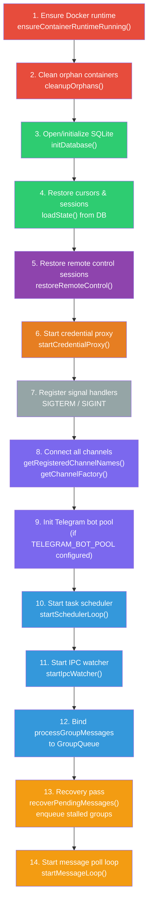
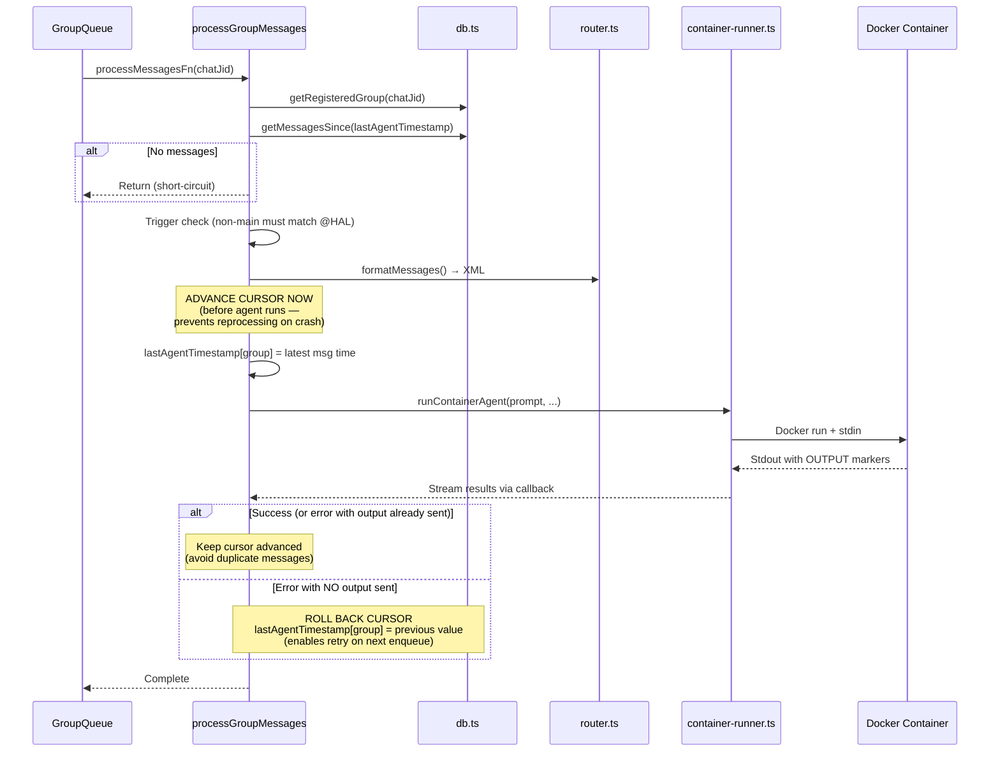
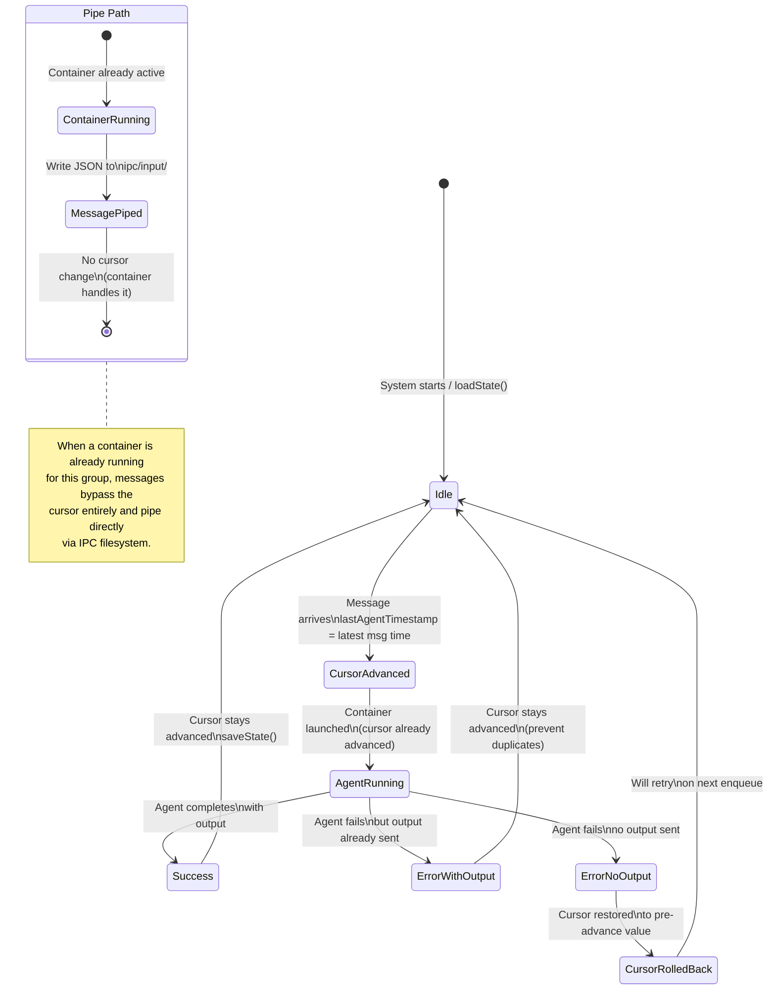

# 003 — The Orchestrator (`src/index.ts`)

*2026-03-20 — Deep structural analysis of the system's brain*

## One-Sentence Purpose

Main entry point and message loop controller that coordinates channel connections, message polling, agent invocation via containers, and graceful shutdown.

## Structural Breakdown

| Section | Lines (approx) | Purpose |
|---------|-------|---------|
| Imports & Setup | 1–70 | Load dependencies |
| Global State | 70–80 | Message loop state, session tracking, registered groups |
| State Management | 80–100 | `loadState()` / `saveState()` — persist cursors and sessions to SQLite |
| Group Registration | 100–125 | `registerGroup()` — validate and store group metadata |
| Group Enumeration | 130–145 | `getAvailableGroups()` — export sorted group list for agent visibility |
| Message Processing | 155–290 | `processGroupMessages()` — core: fetch, trigger check, invoke agent, persist outbound responses (OBS.LOG.02) |
| Agent Execution | 290–370 | `runAgent()` — wrap container invocation, track sessions, write snapshots |
| Main Message Loop | 370–490 | `startMessageLoop()` — infinite poll, deduplicate, queue or pipe (cursor no longer advanced on pipe — RESP.IPC.01) |
| Startup Recovery | 495–510 | `recoverPendingMessages()` — check for stalled messages on restart |
| Container System Init | 510–515 | Verify Docker runtime, clean orphans |
| Main & Shutdown | 515–755 | `main()` — startup sequence, graceful shutdown (SVC.SHUT.01), channel connection, outbound message persistence |

## Global State

Five mutable globals drive the system:

```text
┌─────────────────────────────────────────────────────────────────────────┐
│                         GLOBAL STATE (src/index.ts)                     │
├─────────────────────┬───────────────────────────────────────────────────┤
│ lastTimestamp        │ Newest message seen across ALL groups (cursor)   │
│                      │ Persisted to SQLite via saveState()              │
├─────────────────────┼───────────────────────────────────────────────────┤
│ sessions             │ Map: groupFolder → sessionId                    │
│                      │ Agent conversation continuity across restarts   │
├─────────────────────┼───────────────────────────────────────────────────┤
│ registeredGroups     │ Map: JID → RegisteredGroup                     │
│                      │ Who the system knows about (loaded from SQLite) │
├─────────────────────┼───────────────────────────────────────────────────┤
│ lastAgentTimestamp   │ Map: groupFolder → timestamp                   │
│                      │ Per-group cursor for retry/rollback logic       │
├─────────────────────┼───────────────────────────────────────────────────┤
│ queue                │ GroupQueue instance                             │
│                      │ Container concurrency management               │
├─────────────────────┼───────────────────────────────────────────────────┤
│                      │                                                 │
│  ┌──────────────┐    │  ┌──────────────┐    ┌───────────────────┐      │
│  │  channels[]  │    │  │ messageLoop  │    │ credential-proxy  │      │
│  │  Connected   │    │  │  Running?    │    │  HTTP server      │      │
│  │  Channel[]   │    │  │  (boolean)   │    │  (for containers) │      │
│  └──────────────┘    │  └──────────────┘    └───────────────────┘      │
└─────────────────────┴───────────────────────────────────────────────────┘
         │                       │                       │
         ▼                       ▼                       ▼
    channels/               group-queue.ts         credential-proxy.ts
    registry.ts             container-runner.ts
```

## Startup Sequence (in order)



## Message Processing Flow

`processGroupMessages(chatJid)` — called when GroupQueue gives a group its turn:



## Cursor Management States

Three timestamp cursors with rollback logic:



## Complexity Hotspots

1. **Cursor management** — Three timestamp cursors with rollback logic. Race condition possible if container crashes between cursor advance and processing start.

2. **Idle timeout logic** — Timer only resets on actual agent output, not session updates. Long-thinking agents with no intermediate output may be killed prematurely.

3. **Piping vs. queueing decision** — If container is already running, messages pipe directly via IPC; otherwise queued. Race condition if container dies between check and pipe write.

4. **Trigger checking appears twice** — in message loop AND per-group processor. Could diverge if allowlist changes between checks.

5. **Session ID tracking** — Updated both in streaming callback and in synchronous return. If both fire, could overwrite newer with older.

## Import Dependency Map

Every module imported by `src/index.ts` and where to read more:

| Import | Source | Walkthrough Entry |
|--------|--------|-------------------|
| `config.ts` | `TRIGGER_PATTERN`, `IDLE_TIMEOUT`, `POLL_INTERVAL`, etc. | [002-connective-tissue.md](002-connective-tissue.md#srcconfigts-94-loc--the-knobs) |
| `credential-proxy.ts` | `startCredentialProxy()` | [007-security.md](007-security.md) |
| `channels/registry.ts` | `getChannelFactory()`, `getRegisteredChannelNames()` | [006-channels.md](006-channels.md) |
| `container-runner.ts` | `runContainerAgent()`, `writeGroupsSnapshot()`, `writeTasksSnapshot()` | [004-container-runner.md](004-container-runner.md) |
| `container-runtime.ts` | `ensureContainerRuntimeRunning()`, `cleanupOrphans()` | [004-container-runner.md](004-container-runner.md) |
| `db.ts` | All SQLite operations | [005-data-layer.md](005-data-layer.md) |
| `group-queue.ts` | `GroupQueue` class | [002-connective-tissue.md](002-connective-tissue.md#srcgroup-queuets-365-loc--the-traffic-controller) |
| `group-folder.ts` | `resolveGroupFolderPath()` | — |
| `ipc.ts` | `startIpcWatcher()` | [002-connective-tissue.md](002-connective-tissue.md#srcipcts-465-loc--the-nervous-system) |
| `router.ts` | `findChannel()`, `formatMessages()`, `formatOutbound()` | [002-connective-tissue.md](002-connective-tissue.md#srcrouterts-52-loc--the-postman) |
| `remote-control.ts` | `restoreRemoteControl()`, `startRemoteControl()`, `stopRemoteControl()` | — |
| `sender-allowlist.ts` | `isSenderAllowed()`, `isTriggerAllowed()`, `loadSenderAllowlist()` | [007-security.md](007-security.md) |
| `task-scheduler.ts` | `startSchedulerLoop()` | [002-connective-tissue.md](002-connective-tissue.md#srctask-schedulerts-282-loc--the-clock) |
| `types.ts` | `Channel`, `NewMessage`, `RegisteredGroup` | [002-connective-tissue.md](002-connective-tissue.md#srctypests-108-loc--the-vocabulary) |
| `logger.ts` | `logger` | — |

## Estimated Review Time

~45 human-minutes for careful read. Add 15 minutes if unfamiliar with the type system.

---

## See Also

- [001-codebase-census.md](001-codebase-census.md) — Codebase size and churn (structural context)
- [002-connective-tissue.md](002-connective-tissue.md) — The files `index.ts` depends on (types, config, IPC, queue, router, scheduler)
- [004-container-runner.md](004-container-runner.md) — Container spawning (`runContainerAgent()` called from `runAgent()`)
- [005-data-layer.md](005-data-layer.md) — SQLite schema backing cursor persistence and message storage
- [006-channels.md](006-channels.md) — Channel implementations connected during startup
- [007-security.md](007-security.md) — Security model (credential proxy, sender allowlist, trigger checks)
- [008-fleet-personality.md](008-fleet-personality.md) — Fleet architecture (proxy port routing through prime)
- [010-exploration-map.md](010-exploration-map.md) — Next areas to explore
