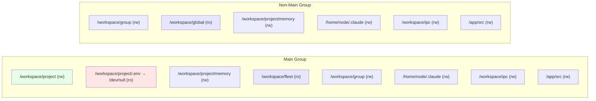
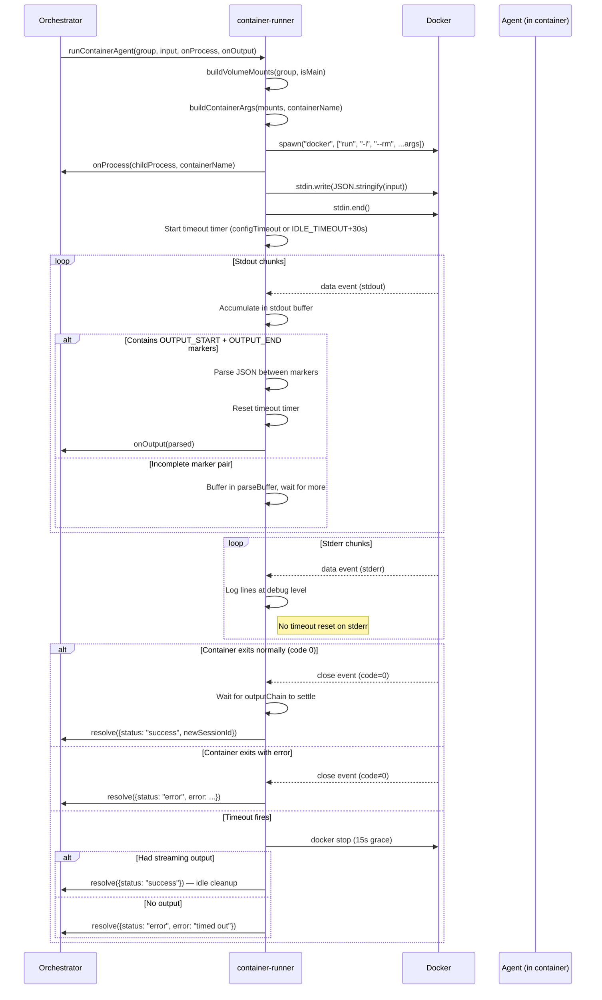
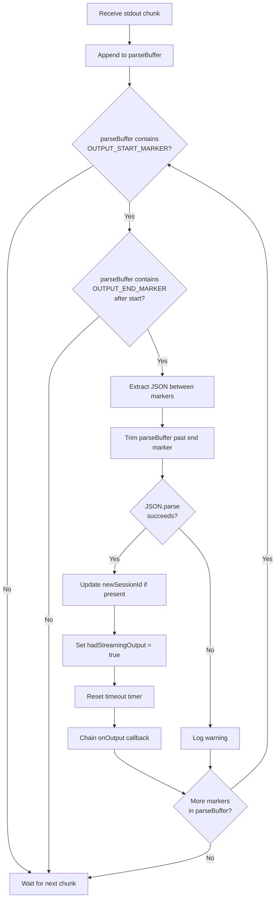

# 004 — Container Runner (`src/container-runner.ts`)

*2026-03-20 — How agents are born, fed, and reaped*

## One-Sentence Purpose

Spawns Docker containers for agent execution with per-group filesystem isolation, credential proxying, and streamed output parsing via sentinel markers.

## Functions

| Function | Lines | Purpose |
|----------|-------|---------|
| `buildVolumeMounts()` | ~60–290 | Constructs mount list: read-only project, writable group/memory/IPC, credential shadow, fleet visibility |
| `buildContainerArgs()` | ~290–340 | Translates mounts + auth into `docker run` CLI args |
| `runContainerAgent()` | ~340–770 | Main entry: spawn, pipe stdin, stream output, parse buffer cap, valid frame tracking, timeout, reap |
| `writeTasksSnapshot()` | ~770–795 | Filter tasks by group visibility, write to IPC |
| `writeGroupsSnapshot()` | ~800–833 | Write group list to IPC (main sees all; non-main sees empty) |

The orchestrator ([003-orchestrator.md](003-orchestrator.md)) calls `runContainerAgent()` for every inbound message that passes the trigger filter. The orchestrator also calls `writeTasksSnapshot()` and `writeGroupsSnapshot()` to pre-populate the IPC namespace before each spawn.

## Docker Command Construction

`docker run -i --rm --name <container-name> [env flags] [mount flags] [image]`

**Environment injected:**
- `TZ` — matches host timezone
- `ANTHROPIC_BASE_URL` — points to credential proxy (`http://host.docker.internal:<port>`)
- `ANTHROPIC_API_KEY` or `CLAUDE_CODE_OAUTH_TOKEN` — placeholder (proxy replaces with real secret)

## Mount Security Model

For a full treatment of the credential proxy and `.env` shadowing rationale, see [007-security.md](007-security.md).

### Main group (elevated)
- `/workspace/project` — project root **writable** (sysadmin mode)
- `/workspace/project/.env` — **shadowed to /dev/null** (agent can't read secrets)
- `/workspace/project/memory` — writable for memctl
- `/workspace/fleet` — read-only fleet visibility (peer microHALs)
- `/workspace/group` — own folder, writable

### Non-main groups (sandboxed)
- `/workspace/group` — own folder only, writable
- `/workspace/global` — read-only shared directory
- `/workspace/project/memory` — writable for memctl
- No project root access, no fleet visibility

### Common to all
- `/home/node/.claude/` — per-group SDK sessions (isolated directory per group)
- `/workspace/ipc` — per-group IPC namespace (writable)
- Container skills synced from `container/skills/`

### Mount Hierarchy: Main vs Non-Main



### Docker Filesystem Layout Inside a Container

```text
/
├── app/
│   └── src/                    ← agent-runner source (rw, per-group copy)
│       ├── index.ts
│       └── VERSION
├── home/
│   └── node/
│       ├── .claude/            ← SDK sessions & settings (rw, per-group)
│       │   ├── settings.json
│       │   └── skills/         ← synced from container/skills/
│       └── .gmail-mcp/         ← Gmail OAuth tokens (rw, if present)
└── workspace/
    ├── project/                ← [main only] project root (rw)
    │   ├── .env                ← shadowed → /dev/null
    │   ├── memory/             ← writable overlay (all groups)
    │   │   ├── notes/
    │   │   └── archive/
    │   ├── tools/memctl/       ← [non-main only] read-only
    │   └── memctl.yaml         ← [non-main only] read-only
    ├── group/                  ← own group folder (rw)
    │   └── logs/
    ├── global/                 ← [non-main only] shared dir (ro)
    ├── fleet/                  ← [main only] halfleet (ro)
    └── ipc/                    ← per-group IPC namespace (rw)
        ├── messages/
        ├── tasks/
        ├── input/
        ├── current_tasks.json
        └── available_groups.json
```

## Container Lifecycle

The orchestrator ([003-orchestrator.md](003-orchestrator.md)) invokes `runContainerAgent()`. The full spawn-to-reap sequence:



## Output Protocol

Sentinel markers on stdout:
```
---NANOCLAW_OUTPUT_START---
{"status":"success","result":"...","newSessionId":"..."}
---NANOCLAW_OUTPUT_END---
```

Multiple marker pairs may appear (one per agent turn). Host parses in a streaming loop, calling `onOutput` callback for each. Timeout resets only on marker detection, not on arbitrary stderr.

### Output Parsing State Machine



## Timeout & Reaping

- Default timeout: 30 minutes (configurable per-group via `containerConfig.timeout`)
- Hard minimum: `IDLE_TIMEOUT + 30s` grace period
- Reaping: `docker stop` with 15s timeout, fallback to SIGKILL
- Timeout after output = successful idle cleanup
- Timeout with no output = error

The `.env` shadow and credential proxy together form the secrets isolation boundary — containers never hold real credentials. See [007-security.md](007-security.md) for the full threat model.

## Complexity Hotspots

1. ~~**Sentinel parsing buffer**~~ — *Resolved (CTR.PARSE.02):* `parseBuffer` now capped at `MAX_PARSE_BUFFER` with front-truncation when exceeded.
2. ~~**Output chain stall**~~ — *Partially resolved (CTR.CHAIN.01):* `onOutput` callbacks wrapped with `.catch()` so a rejected callback no longer wedges the chain. Still worth monitoring.
3. **Valid frame tracking** (CTR.PARSE.03) — Container exit with 0 valid frames now returns error instead of silent success.
4. **Mount sync for agent-runner source** — compares VERSION files; thrashes if VERSION missing.
5. **Auth mode detection** — called on every spawn with no caching.

## Estimated Review Time

~55–70 human-minutes. Mount security audit alone is 12–15 minutes.

## See Also

- [003-orchestrator.md](003-orchestrator.md) — calls `runContainerAgent()` and pre-populates IPC snapshots
- [005-data-layer.md](005-data-layer.md) — session persistence (`sessions` table) for `newSessionId`
- [007-security.md](007-security.md) — credential proxy, `.env` shadowing, mount allowlists
- [008-fleet-personality.md](008-fleet-personality.md) — fleet directory mounted at `/workspace/fleet`
- [002-connective-tissue.md](002-connective-tissue.md) — task scheduler that triggers container spawns
