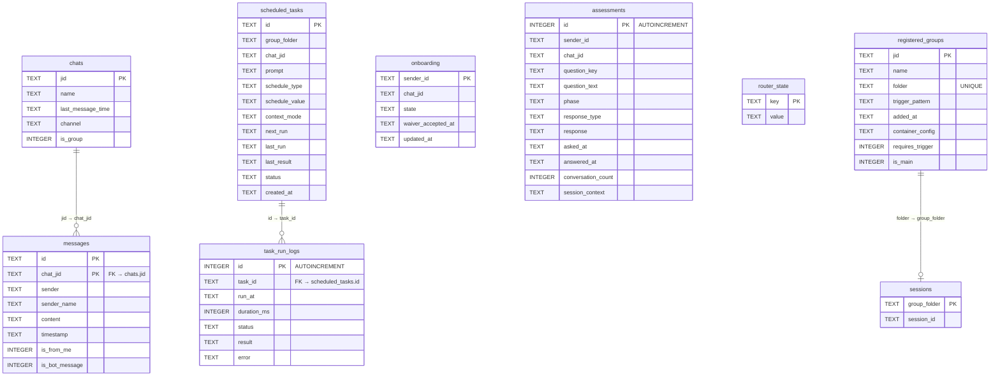
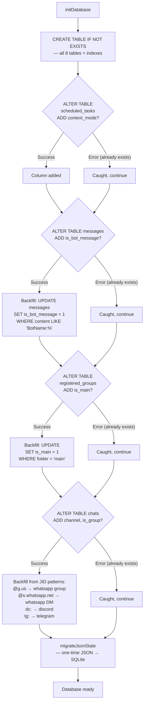

# 005 — Data Layer (`src/db.ts`)

*2026-03-20 — What gets stored and how*

## One-Sentence Purpose

SQLite data layer managing chats, messages, scheduled tasks, sessions, group registrations, onboarding state, and router telemetry with safe append-only migrations.

## Schema (8 tables)

| Table | Primary Key | Purpose |
|-------|-------------|---------|
| `chats` | `jid` | Chat/group metadata (name, channel, last activity, is_group flag) |
| `messages` | `(id, chat_jid)` | All inbound/outbound messages with sender, timestamp, bot flags |
| `scheduled_tasks` | `id` | Cron/interval/once tasks with state machine (active/paused/completed) |
| `task_run_logs` | `id` (auto) | Execution history per task (duration, status, result, error) |
| `onboarding` | `sender_id` | User onboarding state machine (first_contact → welcome_sent → active) |
| `assessments` | `id` (auto) | Likert + qualitative assessment responses (unique per sender+question) |
| `router_state` | `key` | Key-value store for cursors and internal state |
| `sessions` | `group_folder` | Maps group folder → Claude SDK session ID |
| `registered_groups` | `jid` | Group registry (folder, trigger, permissions, container config) |

### Entity-Relationship Diagram



### Table-to-Subsystem Map

| Table | Primary Consumer | Walkthrough Link |
|-------|-----------------|------------------|
| `chats` | Channel adapters (metadata sync) | [006-channels.md](006-channels.md) |
| `messages` | Orchestrator (message loop) | [003-orchestrator.md](003-orchestrator.md) |
| `scheduled_tasks` | Task scheduler | [002-connective-tissue.md](002-connective-tissue.md#task-scheduler) |
| `task_run_logs` | Task scheduler (audit trail) | [002-connective-tissue.md](002-connective-tissue.md#task-scheduler) |
| `onboarding` | Channel adapters (welcome flow) | [006-channels.md](006-channels.md) |
| `assessments` | Fleet personality system | [008-fleet-personality.md](008-fleet-personality.md) |
| `router_state` | Orchestrator (cursor tracking) | [003-orchestrator.md](003-orchestrator.md) |
| `sessions` | Container runner (session continuity) | [004-container-runner.md](004-container-runner.md) |
| `registered_groups` | Orchestrator + container runner | [003-orchestrator.md](003-orchestrator.md) |

## Key Functions

**Messages:**
- `getNewMessages(jids[], lastTimestamp, botPrefix, limit)` — finds unprocessed user messages across multiple chats. Simple `ORDER BY timestamp ASC LIMIT N` returns the oldest unseen messages first.
- `getMessagesSince(chatJid, since, botPrefix, limit)` — single-chat variant.
- `storeMessageDirect(msg)` — persists outbound agent responses to SQLite for observability (OBS.LOG.02).

**Tasks:**
- `getDueTasks()` — active tasks where `next_run <= now()`, ordered by next_run.
- `updateTaskAfterRun(id, nextRun, lastResult)` — advances next_run; sets status='completed' if nextRun is null.

**Groups:**
- `getAllRegisteredGroups()` — returns typed map, filters invalid folders with warnings, deserializes JSON containerConfig.

**State & Sessions:**
- `getSession()` / `setSession()` — read/write Claude SDK session IDs per group folder. The orchestrator ([003-orchestrator.md](003-orchestrator.md)) loads the session before spawning a container, and saves the `newSessionId` returned by the container runner ([004-container-runner.md](004-container-runner.md)).
- `getRouterState()` / `setRouterState()` — cursor persistence for the message polling loop.

### Message Query Flow

Both `getNewMessages()` and `getMessagesSince()` use a straightforward `ORDER BY timestamp ASC LIMIT N` — returning the oldest unseen messages first, in chronological order.

```text
SELECT id, chat_jid, sender, sender_name, content, timestamp, is_from_me
FROM messages
WHERE timestamp > ? AND chat_jid IN (...)
  AND is_bot_message = 0 AND is_from_me = 0
  AND content NOT LIKE 'BotName:%'
  AND content != '' AND content IS NOT NULL
ORDER BY timestamp ASC
LIMIT ?

Result: up to N rows, oldest-first from the cursor position.
```

*Historical note:* An earlier version used a DESC subquery reversal to return the *newest* N messages. This was replaced (DAT.QUERY.01) because it permanently skipped older messages when backlogs exceeded the cap — the agent could never catch up.

## Migration Strategy

Append-only ALTER TABLE via `migrateColumn()` helper (DAT.MIG.01). The helper distinguishes "duplicate column" (safe to skip) from real errors (disk full, corruption) — propagating the latter instead of silently swallowing:
- `context_mode` added to scheduled_tasks (default: 'isolated')
- `is_bot_message` added to messages (backfilled from ASSISTANT_NAME prefix)
- `is_main` added to registered_groups (backfilled where folder = 'main')
- `channel` and `is_group` added to chats (backfilled from JID patterns)

No schema version tracking — relies on migrateColumn() idempotence.

### Migration Flow



## Security Notes

- All queries parameterized (no SQL injection risk)
- Dynamic SQL in `updateTask()` builds field list at runtime but parameters are safe
- No raw SQL exposed to containers

See [007-security.md](007-security.md) for the broader container isolation model that keeps agents from accessing the database file directly.

## Complexity Hotspots

1. **Message query filters** — dual filtering by is_bot_message AND content prefix for backward compat.
2. ~~**Migration safety**~~ — *Resolved (DAT.MIG.01):* `migrateColumn()` now propagates real errors. Only "duplicate column" is swallowed.
3. **Chat metadata upserts** — MAX() function for timestamp ordering could invert if system clock skews.

## Estimated Review Time

~35–40 human-minutes.

## See Also

- [003-orchestrator.md](003-orchestrator.md) — loads state from `router_state`, `sessions`, and `registered_groups` on every tick
- [004-container-runner.md](004-container-runner.md) — writes `newSessionId` back to `sessions` table after container completion
- [006-channels.md](006-channels.md) — channel adapters call `storeMessage()`, `storeChatMetadata()`, and onboarding functions
- [002-connective-tissue.md](002-connective-tissue.md) — task scheduler reads `scheduled_tasks` and writes `task_run_logs`
- [008-fleet-personality.md](008-fleet-personality.md) — assessment protocol writes to `assessments` table
- [009-halos-ecosystem.md](009-halos-ecosystem.md) — `halctl session` manages the `sessions` table via `halctl`
