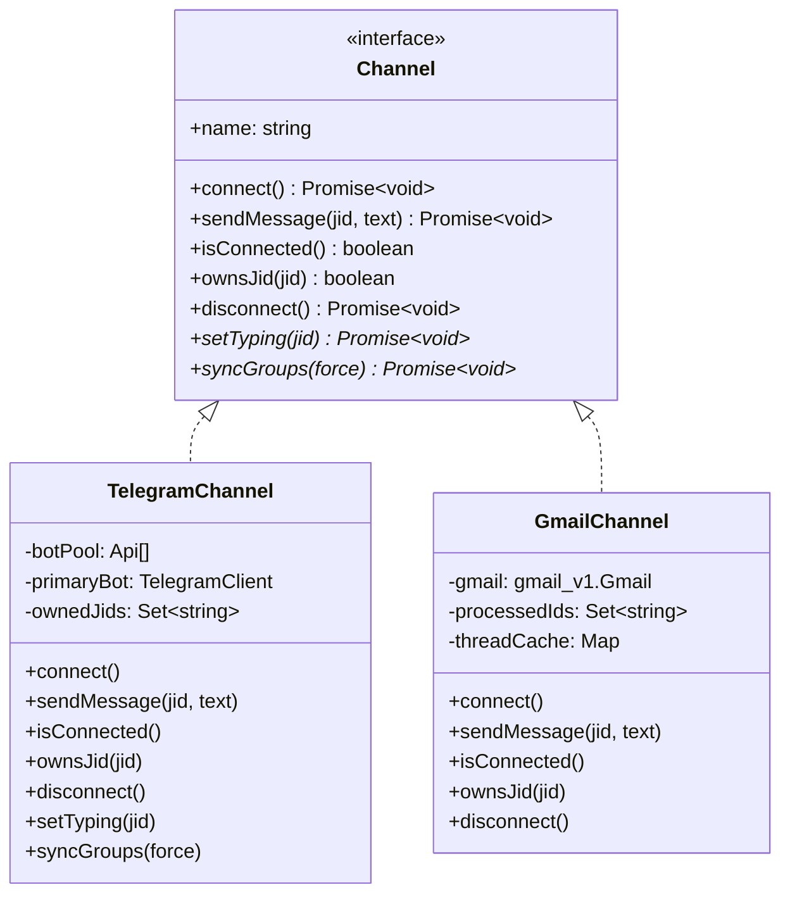
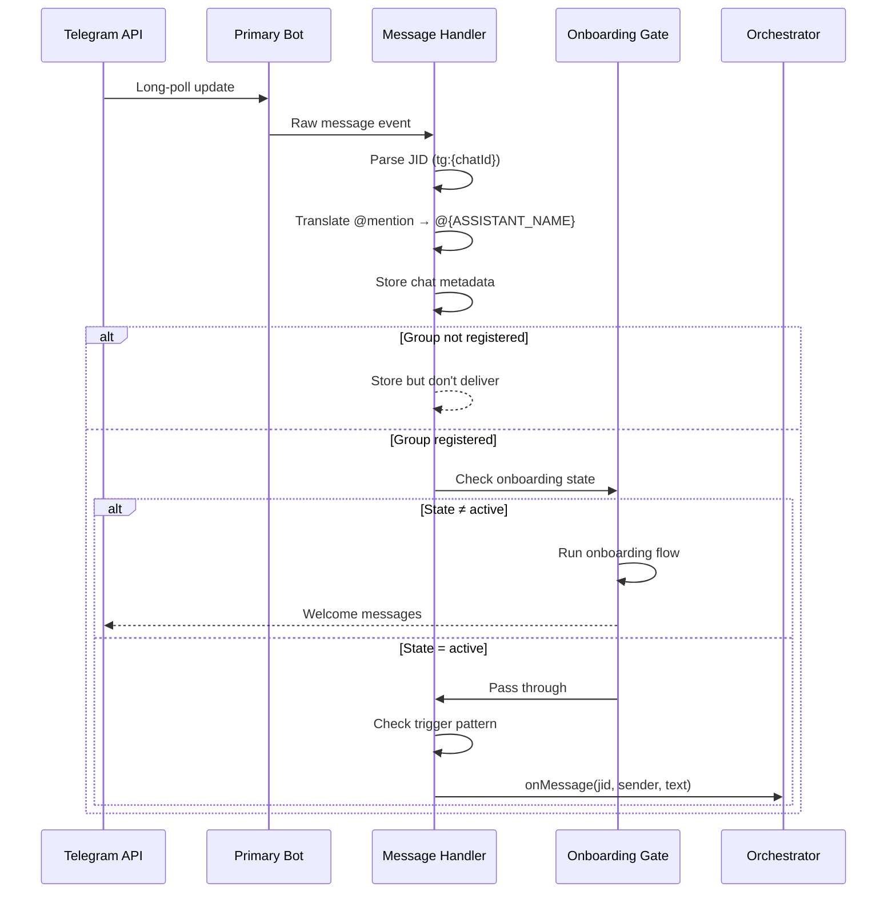
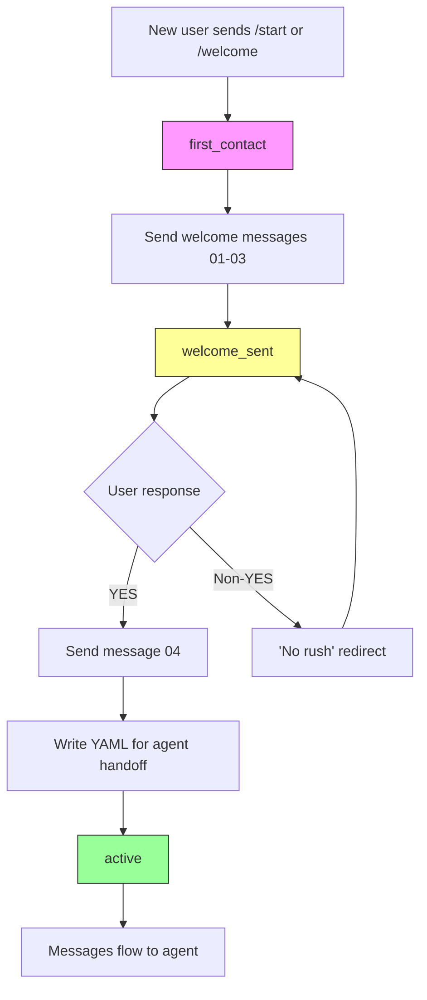
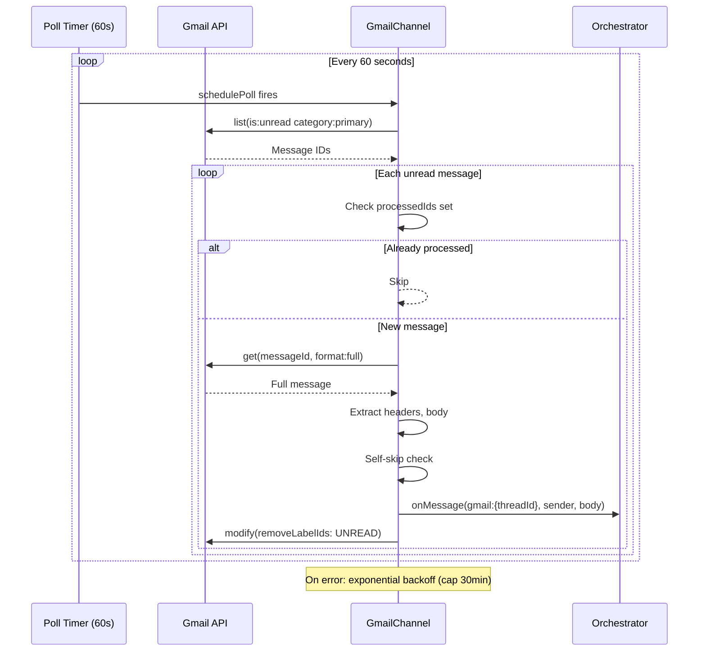

# 006 — Channel System

*2026-03-20 — How messages enter and leave the system*

## One-Sentence Purpose

Pluggable channel abstraction that lets Telegram, Gmail, and future platforms connect via a common interface with callback-driven message delivery.

## Architecture

```
Channel implementations register factories at module load time
  → index.ts imports trigger registration
  → Orchestrator calls factories with unified callbacks
  → Each channel polls/listens independently
  → Inbound: channel → onMessage callback → orchestrator
  → Outbound: orchestrator → routeOutbound → channel.sendMessage
```

The orchestrator creates channels and wires callbacks during startup — see [003-orchestrator.md](003-orchestrator.md) for that initialization sequence. Outbound message routing is handled by the router module — see [002-connective-tissue.md](002-connective-tissue.md#router).

### Registry (`src/channels/registry.ts`, 31 LOC)

Factory pattern. Each channel calls `registerChannel(name, factory)` at import time. Factory returns `Channel | null` (null = credentials missing, skip gracefully).

### Channel Interface

```typescript
interface Channel {
  name: string;
  connect(): Promise<void>;
  sendMessage(jid: string, text: string): Promise<void>;
  isConnected(): boolean;
  ownsJid(jid: string): boolean;      // Routes messages to correct channel
  disconnect(): Promise<void>;
  setTyping?(jid: string): Promise<void>;  // Optional
  syncGroups?(force: boolean): Promise<void>;  // Optional
}
```



### JID Namespace Convention

| Channel | JID Format | Example |
|---------|-----------|---------|
| Telegram | `tg:{chatId}` | `tg:-1001234567890` |
| Gmail | `gmail:{threadId}` | `gmail:18e3f2a1b4c5d6e7` |
| Slack | `slack:{channelId}` | (future) |
| Discord | `dc:{serverId}:{channelId}` | (future) |

## Telegram (`src/channels/telegram.ts`, 582 LOC)

### Telegram Message Processing



### Bot Pool (multi-persona messaging)
- Array of send-only `Api` instances (no polling, outbound only)
- Round-robin assignment: `"{groupFolder}:{senderName}" → poolIndex`
- On first assignment: renames bot via `setMyName(sender)`, waits 2s for propagation
- Splits messages at 4096 chars (Telegram limit)
- Purpose: agent teams send with different displayed names

```text
Bot Pool Round-Robin Assignment
═══════════════════════════════

  Key: "{groupFolder}:{senderName}"

  ┌──────────────────────┐
  │  Assignment Map      │
  │                      │
  │  "main:HAL"    → 0   │──→  Bot[0]  (displays as "HAL")
  │  "main:Ben"    → 1   │──→  Bot[1]  (displays as "Ben")
  │  "main:Scout"  → 2   │──→  Bot[2]  (displays as "Scout")
  │  "dev:HAL"     → 3   │──→  Bot[3]  (displays as "HAL")
  │  ...                  │
  └──────────────────────┘

  On first use of a slot:
    1. setMyName(senderName)  ← Telegram API rename
    2. sleep(2000ms)          ← Wait for propagation
    3. Send message

  Subsequent uses of same slot: send immediately
```

### Onboarding Gate
State machine intercepting messages before agent sees user:
1. `/start` or `/welcome` → sends welcome messages 01-03
2. State: `welcome_sent` → waits for YES/NO
3. YES → sends message 04, advances to `active`, writes per-sender YAML to `memory/onboarding/{groupFolder}-{senderId}.yaml` for agent handoff (FLT.ONBOARD.01 — prevents concurrent onboarding flows from overwriting each other)
4. Non-YES → "No rush" redirect



### Message Handler
- Parses `tg:{chatId}` JID, claims ownership
- Translates @bot-mention into `@{ASSISTANT_NAME}` trigger
- Stores chat metadata (type, name, timestamp)
- Only delivers full message if group is registered
- Non-text messages stored as placeholders: `[Photo]`, `[Document: filename]`, etc.

### Key Design
- Markdown fallback: tries Markdown parse, falls back to plain text on error
- JID ownership bootstrap: empty set → claims all `tg:` JIDs (first bot wins)

## Gmail (`src/channels/gmail.ts`, 374 LOC)

### Polling Model
- Polls `is:unread category:primary` every 60s
- Exponential backoff on error (cap: 30 minutes)
- Processed IDs tracked in memory set (capped at 5000)
- IDs added *after* successful processing, not before (CHL.GM.02 — transient failures no longer permanently suppress redelivery)



### Email Processing
- Extracts From, Subject, Message-ID, threadId from headers
- Self-skip: ignores emails from bot's own address (prevents loops)
- Body extraction: prefers text/plain, recurses into multipart
- Routes to **main group only** (emails always go to prime)

### Reply Composition
- Caches thread metadata (sender, subject, messageId) per threadId
- Replies with proper `In-Reply-To` and `References` headers
- Adds `Re:` prefix to subject

### Key Difference from Telegram
- No onboarding gate (email is trusted)
- No bot pool (email has no persona concept)
- Short-poll (60s) vs Telegram's long-poll

## Estimated Review Time

| File | LOC | Time |
|------|-----|------|
| registry.ts | 31 | 3 min |
| telegram.ts | 582 | 45 min |
| gmail.ts | 374 | 35 min |
| index.ts | 15 | 2 min |
| **Total** | **981** | **~85 min** |

## See Also

- [003-orchestrator.md](003-orchestrator.md) — where channels are created, callbacks wired, and the message loop runs
- [002-connective-tissue.md](002-connective-tissue.md#router) — outbound routing: how orchestrator responses reach the correct channel
- [005-data-layer.md](005-data-layer.md) — chat metadata and onboarding state persisted in SQLite
- [008-fleet-personality.md](008-fleet-personality.md) — bot pool persona assignment connects to fleet identity
