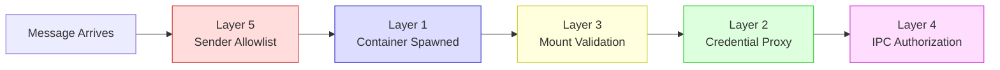
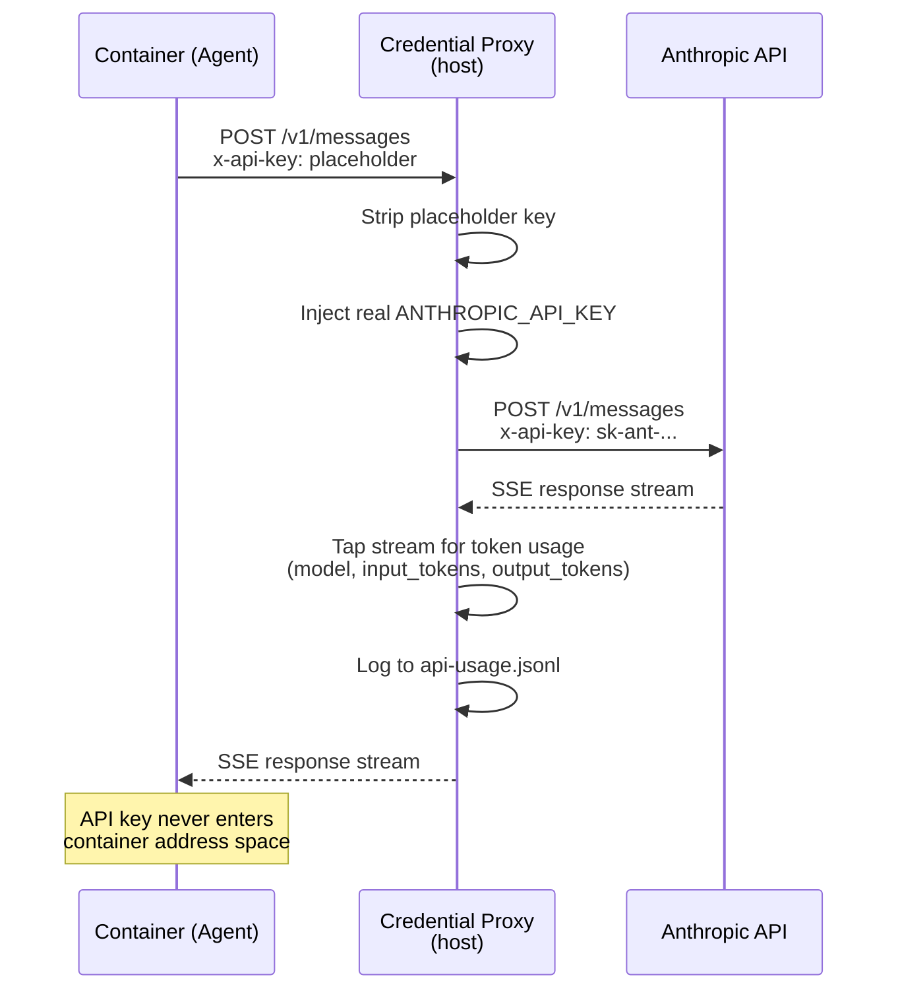
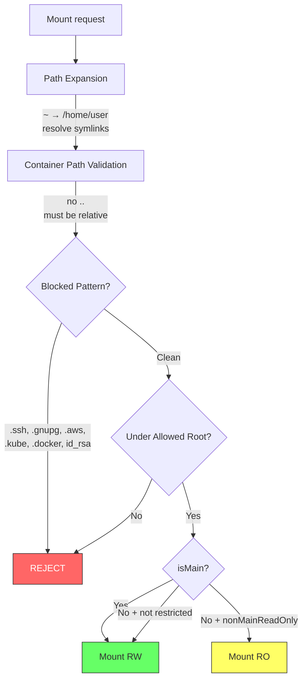

# 007 — Security Model

*2026-03-20 — Defense-in-depth across five layers*

## One-Sentence Purpose

Five interlocking security subsystems prevent containers from accessing secrets, escaping filesystem boundaries, or escalating privileges across groups.

## Security Pipeline Overview



Each layer is independent. If mount validation is compromised, credential proxy still holds. If sender allowlist fails, IPC authorization still enforces group boundaries.

## Layer 1: Container Isolation (Docker)

Containers run in Docker namespaces. Mounts validated before spawn. Non-main groups see read-only views of shared data. See [004-container-runner.md](004-container-runner.md) for how mounts are constructed and passed to Docker.

## Layer 2: Credential Proxy (`src/credential-proxy.ts`, 236 LOC)

**Architecture:** Containers connect to `http://host.docker.internal:<port>` instead of Anthropic API directly. Proxy holds real secrets; container sees only placeholders.

**Two auth modes:**
- **API Key:** Proxy strips incoming `x-api-key` header, injects real key
- **OAuth:** Proxy intercepts token exchange, replaces placeholder Bearer token with real OAuth token



**Telemetry:** SSE response stream tapped for token usage (`model`, `input_tokens`, `output_tokens`). Logged to `api-usage.jsonl`. Best-effort (never crashes proxy).

**Upstream timeout** (RESP.BOUNDARY.01): 5-minute request-level timeout on upstream API calls. Prevents hung connections from consuming the full container timeout budget.

**Key property:** API keys never enter container address space.

## Layer 3: Mount Security (`src/mount-security.ts`, 419 LOC)

**Allowlist:** `~/.config/nanoclaw/mount-allowlist.json` (outside project root — containers can't modify it)

**Validation pipeline:**
1. Path expansion (`~` → home, symlink resolution via `realpathSync`)
2. Container path validation (no `..`, must be relative)
3. Blocked pattern matching (hardcoded: `.ssh`, `.gnupg`, `.aws`, `.kube`, `.docker`, `id_rsa`, etc. + user patterns)
4. Allowed root check (mount must fall under an `allowedRoots` entry)
5. ReadWrite enforcement (non-main forced read-only if `nonMainReadOnly: true`)



See [004-container-runner.md](004-container-runner.md) for how validated mounts are assembled into Docker run arguments.

## Layer 4: IPC Authorization (`src/ipc.ts`)

Every IPC operation checks `isMain`. See [002-connective-tissue.md](002-connective-tissue.md#ipc) for the IPC transport mechanics and file-watching protocol.

| Operation | Main | Non-Main |
|-----------|------|----------|
| schedule_task | Any group | Own group only |
| pause/resume/cancel_task | Any task | Own tasks only |
| send_message | Any JID | Own chat only |
| register_group | Yes | **BLOCKED** |
| refresh_groups | Yes | **BLOCKED** |

```text
isMain Privilege Matrix
═══════════════════════

                        isMain = true          isMain = false
                    ┌─────────────────────┬─────────────────────┐
  schedule_task     │  Any group           │  Own group only     │
                    ├─────────────────────┼─────────────────────┤
  pause/resume/     │  Any task            │  Own tasks only     │
  cancel_task       │                      │                     │
                    ├─────────────────────┼─────────────────────┤
  send_message      │  Any JID             │  Own chat only      │
                    ├─────────────────────┼─────────────────────┤
  register_group    │  ✓ ALLOWED           │  ✗ BLOCKED          │
                    ├─────────────────────┼─────────────────────┤
  refresh_groups    │  ✓ ALLOWED           │  ✗ BLOCKED          │
                    └─────────────────────┴─────────────────────┘

  isMain = true:  telegram_main (prime instance)
  isMain = false: all fleet instances, non-main groups
```

## Layer 5: Sender Allowlist (`src/sender-allowlist.ts`, 146 LOC)

**Config:** `~/.config/nanoclaw/sender-allowlist.json`

Per-chat control over who can trigger the agent:
- `allow: "*"` — any sender
- `allow: ["sender1", "sender2"]` — specific senders
- `mode: "trigger"` — allowed senders trigger agent
- `mode: "drop"` — blocked senders' messages silently discarded

Missing or invalid config falls back to allow-all (prevents lockout).

## Remote Control (`src/remote-control.ts`, 218 LOC)

Spawns detached `claude remote-control` process. Session URL polled from stdout file. Metadata persisted in `remote-control.json` for crash recovery. No credentials stored in session file — only PID and URL.

## Composition

```
Inbound message
  → Sender allowlist check (Layer 5)
  → Container spawned with validated mounts (Layer 3)
  → Container connects via credential proxy (Layer 2)
  → Container runs in Docker isolation (Layer 1)
  → Container's IPC requests authorized (Layer 4)
```

## Estimated Review Time

| File | LOC | Time |
|------|-----|------|
| mount-security.ts | 419 | 12 min |
| credential-proxy.ts | 251 | 15 min |
| sender-allowlist.ts | 146 | 8 min |
| IPC auth (from ipc.ts) | — | 10 min |
| remote-control.ts | 218 | 8 min |
| **Total** | **~1,000** | **~53 min** |

## See Also

- [004-container-runner.md](004-container-runner.md) — mount construction, Docker run arguments, container lifecycle
- [002-connective-tissue.md](002-connective-tissue.md#ipc) — IPC transport, file-watching protocol, authorization context
- [003-orchestrator.md](003-orchestrator.md) — where `isMain` is determined and passed to container-runner
- [006-channels.md](006-channels.md) — sender allowlist operates at the channel layer before orchestration
