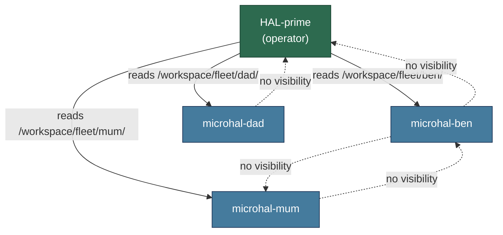
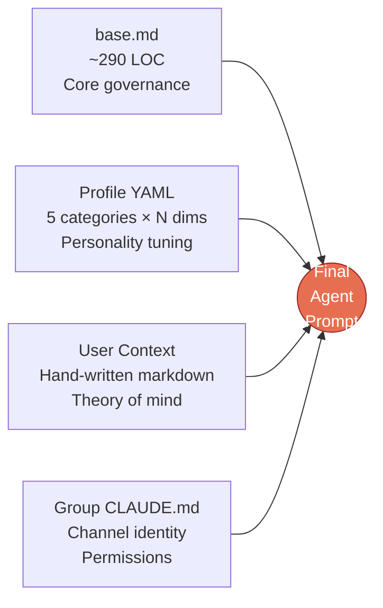
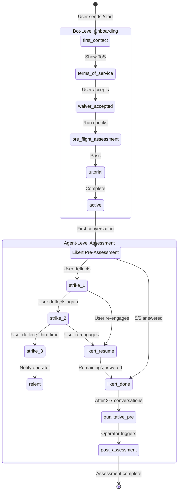
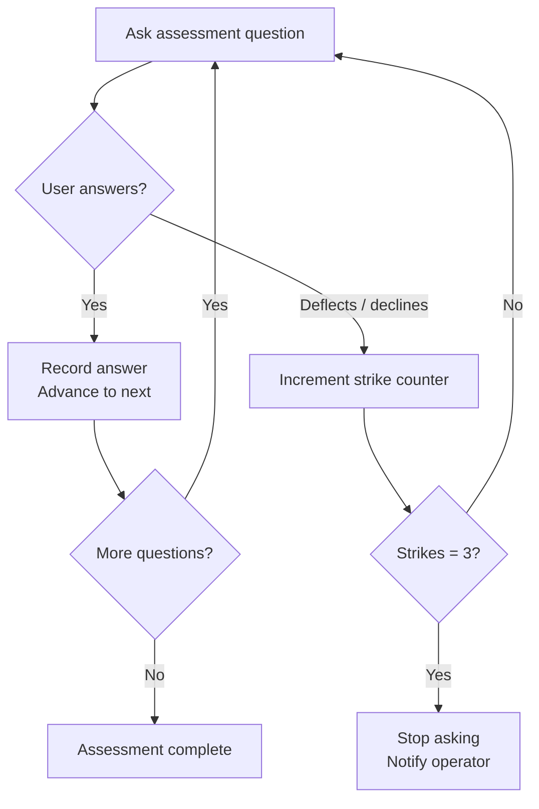

# 008 — Fleet & Personality System

*2026-03-20 — How agents get their identity, users get onboarded, and instances get tested*

## One-Sentence Purpose

Compositional personality system where base governance + dimension profiles + user context + group identity produce fully-parameterised agents, with assessment protocols and behavioral evaluation to verify they work.

## Fleet Concept

A fleet is a collection of independent nanoclaw deployments:

| Instance | User | Bot | Personality |
|----------|------|-----|-------------|
| HAL-prime | Rick (operator) | @minano_tbot | sardonic engineer |
| microhal-ben | Ben (brother) | @hal_micro_ben_1_bot | discovering-ben |
| microhal-dad | The Captain (father) | @HALCaptain_bot | dad |
| microhal-mum | Mum (mother) | @HALMum_bot | mum |



**Isolation model:**
- Prime can see all fleet members at `/workspace/fleet/` (read-only)
- Microhals cannot see each other or prime
- Governance layer locked read-only (chmod 444/555): CLAUDE.md, .claude/, src/, container/, templates/
- Writable areas: workspace/, projects/, groups/, memory/, data/

See [004-container-runner.md](004-container-runner.md) for how fleet visibility mounts are constructed during container spawning.

```text
Filesystem Isolation Model
==========================

HAL-prime sees:                          microhal-ben sees:
┌─────────────────────────────┐          ┌─────────────────────────────┐
│ /workspace/                 │ rw       │ /workspace/                 │ rw
│ /projects/                  │ rw       │ /projects/                  │ rw
│ /groups/                    │ rw       │ /groups/                    │ rw
│ /memory/                    │ rw       │ /memory/                    │ rw
│ /data/                      │ rw       │ /data/                      │ rw
│ ─────────────────────────── │          │ ─────────────────────────── │
│ /CLAUDE.md                  │ ro (444) │ /CLAUDE.md                  │ ro (444)
│ /.claude/                   │ ro (555) │ /.claude/                   │ ro (555)
│ /src/                       │ ro (555) │ /src/                       │ ro (555)
│ /container/                 │ ro (555) │ /container/                 │ ro (555)
│ /templates/                 │ ro (555) │ /templates/                 │ ro (555)
│ ─────────────────────────── │          │                             │
│ /workspace/fleet/ben/       │ ro       │  (no fleet/ directory)      │
│ /workspace/fleet/dad/       │ ro       │                             │
│ /workspace/fleet/mum/       │ ro       │                             │
└─────────────────────────────┘          └─────────────────────────────┘
```

## Personality Composition

Final agent prompt = **base.md** + **personality profile** + **user context** + **group CLAUDE.md**



### Step 1: base.md (~290 LOC)
Core governance applicable to all instances:
- Verification loop, brevity, readback before acting, honesty over comfort
- Onboarding & assessment protocols (three-strike rule, delivery windows)
- Workspace boundaries, available tools
- What the agent is NOT (no cron management, no system config)

### Step 2: Personality Profile (YAML)
Five categories × multiple dimensions:

| Category | Dimensions | Example (Ben) |
|----------|-----------|---------------|
| Information Scoping | brevity, summary_default, overwhelm_detection | minimal, yes, yes |
| Decision Support | max_options, recommendation_strength, paralysis_detection | 1, directive, yes |
| Task Completion | completion_signalling, iteration_cap, scope_creep_detection | firm, 3, yes |
| Emotional Calibration | acknowledgment_mode, frustration_response, energy_riding | brief, pause, yes |
| Tone | warmth, formality, opinion_strength, apology_suppression | warm, casual, opinionated, yes |

Ben's profile is research-backed: 619 conversations, 4,456 human messages, high-confidence scores with provenance tracking.

### Step 3: User Context (hand-written markdown)
`templates/microhal/user/{name}.md` — Rick's notes on each person:
- Theory of mind guidance, proactivity rules
- Financial context, family relationships
- Procrastination detection, decomposition strategies
- This is irreducible human knowledge — not generated

### Step 4: Group CLAUDE.md
Channel-specific identity and permissions:
- Prime gets admin privileges, fleet oversight, Telegram formatting
- Non-prime gets same personality but sandboxed capabilities

## Onboarding Flow

**Bot-level** (before agent sees user) — see [006-channels.md](006-channels.md#telegram-onboarding-gate) for the Telegram implementation:
```
first_contact → terms_of_service → waiver_accepted → pre_flight_assessment → tutorial → active
```
State persisted in `memory/onboarding-state.yaml`.

**Agent-level** (after handoff):
1. **Likert pre-assessment** — 5 questions, 1-5 scale, during first conversation
   - Three-strike rule: if user deflects 3x, relent immediately, notify Rick
   - Partial progress tracked: resume from next unanswered
2. **Qualitative pre-assessment** — 2 open-ended questions after 3-7 conversations
   - Ask permission first, don't interrupt tasks, respect "later"
3. **Post-assessment** — mirror questions, triggered by operator



### Three-Strike Assessment Protocol



See [009-halos-ecosystem.md](009-halos-ecosystem.md#halctl) for `halctl` fleet management commands (create, freeze, fold, fry, assess, smoke).

## Evaluation Systems

### Infrastructure Smoke Test (smoke-test.md)
10-point checklist: identity, permissions, tools, auth, memory, network, filesystem, Python, git, CLAUDE.md governance. Pass/fail per check.

### Behavioral Smoke Tests (behavioral_smoke.py, 2,287 LOC)
Real-token tests of agent compliance. 6 capability dimensions (Task, Memory, Formatting, Command, Auth, Onboarding). 4 test phases. >95% suite acceptance threshold.

### Eval Harness (eval_harness.py, 853 LOC)
**Single-injection scenarios:** Does agent deliver Likert on first conversation? Does it avoid qualitative too early? Does it ask permission?

**Multi-turn dialogue:** Tangent tolerance, deflection recovery, response editing, partial progress tracking.

Output: YAML assessment records with conditions, behaviour, assertions, and turn-by-turn dialogue.

## Estimated Review Time

| Area | Time |
|------|------|
| Template system (base.md, schema, profiles, user context) | ~25 min |
| Fleet system (config, isolation, provisioning) | ~40 min |
| Evaluation system (smoke, behavioral, eval harness) | ~50 min |
| Group CLAUDE.md files | ~15 min |
| **Total** | **~130 min** |

## See Also

- [004-container-runner.md](004-container-runner.md) — mount construction and fleet visibility
- [006-channels.md](006-channels.md) — Telegram onboarding gate (bot-level flow)
- [009-halos-ecosystem.md](009-halos-ecosystem.md) — halctl fleet management, assessment commands
- [003-orchestrator.md](003-orchestrator.md) — how the orchestrator invokes agents with composed prompts
- [010-exploration-map.md](010-exploration-map.md) — where fleet & personality sits in the full codebase
