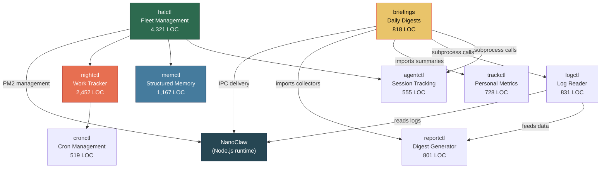
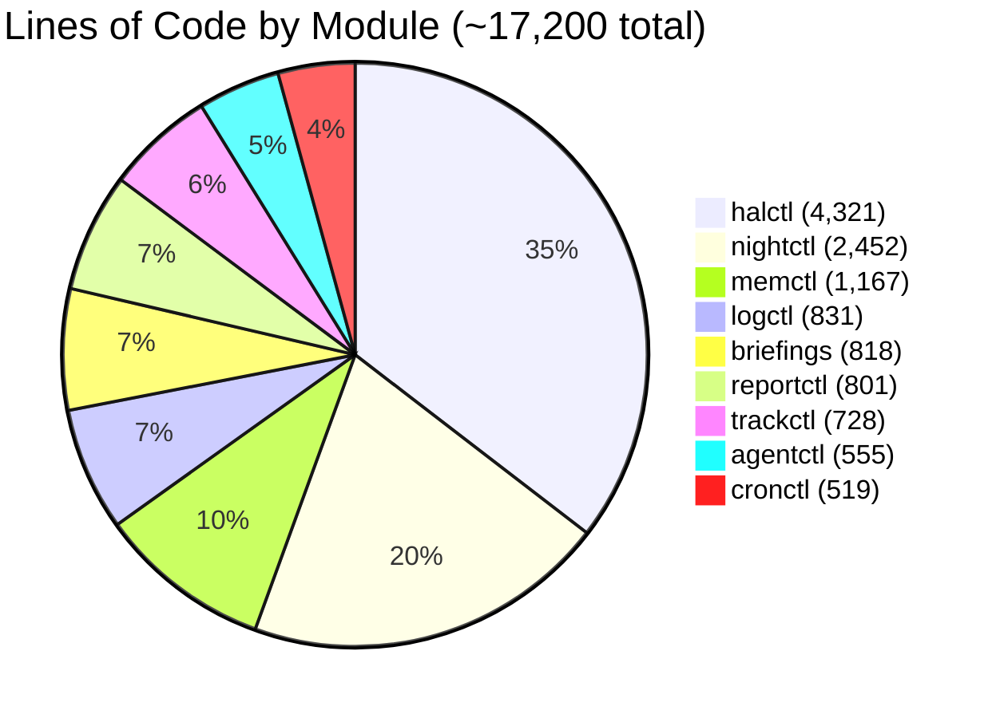
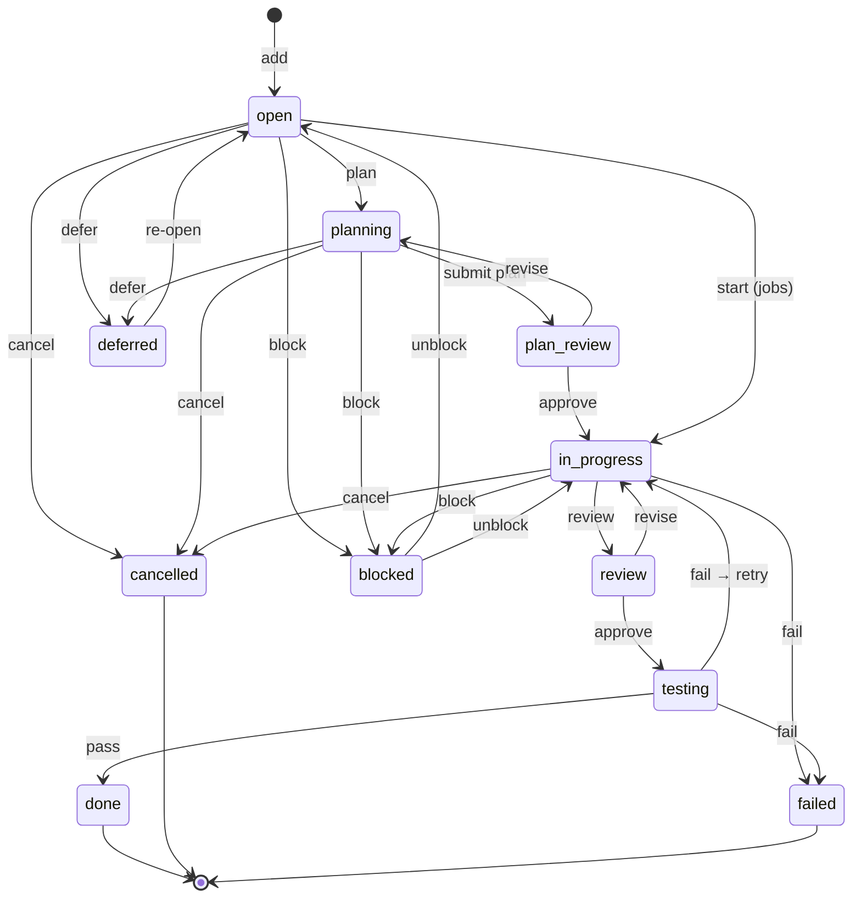
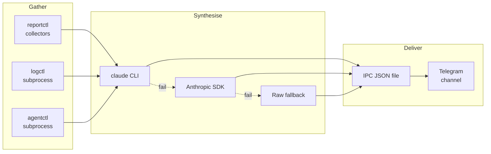

# 009 — Halos Ecosystem

*2026-03-20 — The Python tooling layer (~17,200 LOC)*

## One-Sentence Purpose

Nine CLI tools providing fleet management, work tracking, structured memory, briefings, logging, agent monitoring, cron management, personal metrics tracking, and reporting — collectively larger than the runtime they support.

## Module Map

```
┌──────────────────────────────────────────────┐
│ NanoClaw (Node.js runtime)                   │
│  ├─ IPC (briefings deliver here)             │
│  └─ PM2 (halctl manages instances)           │
└──────────────────────────────────────────────┘
         ↑
    ┌────┼────────────────────┐
    │    │                    │
 halctl  briefings          logctl
 (fleet) (digests)          (logs)
    │       │                 │
    │  ┌────┴────┐           │
    │  │reportctl│ ←─────────┘
    │  │(collect)│
    │  └────┬────┘
    │       │
    ├───────┼──────────┐
    │       │          │
 nightctl memctl    agentctl
 (work)  (memory)  (sessions)
    │
    ├───────┐
 cronctl  trackctl
 (cron)   (metrics)
```



## LOC Distribution



## Module Details

### halctl — Fleet Management (4,321 LOC, COMPLEX)

**Commands:** create, list, status, freeze, fold, fry, reset, assess, smoke, behavioral-smoke, supervise, push, ps, logs, health, messages, restart, session list/clear/clear-all

**Key concepts:**
- Provisions independent nanoclaw instances with locked governance
- Supervisor detects behavioral triggers via phrase matching (e.g., "agent backed down")
- Health checks catch zombies via log activity + pm2 stats
- Session management via SQLite, logged through hlog

See [008-fleet-personality.md](008-fleet-personality.md) for fleet concepts (topology, isolation model, personality composition).

**Review time:** ~120 min

### nightctl — Work Tracker (2,452 LOC, COMPLEX)

**Commands:** add, plan, approve, revise, retry, start, review, testing, done, block, defer, cancel, edit, graph, list, status, run, enqueue, manifest rebuild/verify, archive, hatch, stats

**Key concepts:**
- Unified model: tasks, jobs, agent-jobs with kind-aware state machine
- Plan validation gates (XML or context-only)
- Atomic writes (yaml.tmp + os.replace)
- Dependency tracking, retry logic, overnight execution windows



**Review time:** ~110 min

### memctl — Structured Memory (1,167 LOC, MODERATE)

**Commands:** new, get, search, index rebuild/verify, link, prune, stats, graph, enrich

**Key concepts:**
- Atomic notes with tags, entities, confidence, backlinks
- Decay function for pruning (backlink count + age + confidence)
- Graph visualization (text/HTML/DOT)
- Index drift detection via SHA256

Memory governance is configured in `memctl.yaml` at the repo root. The lookup protocol starts from `memory/INDEX.md` — see the Memory System section in [CLAUDE.md](../../../CLAUDE.md) for the full workflow.

**Review time:** ~80 min

### briefings — Daily Digests (818 LOC, MODERATE)

**Commands:** morning, nightly, diary, nightctl

**Key concepts:**
- Data gathered from reportctl collectors + subprocess calls to logctl/agentctl
- Three synthesis strategies: claude CLI → Anthropic SDK → raw fallback
- Delivery via NanoClaw IPC (JSON files → Telegram)
- Diary writes autonomous reflections to `memory/reflections/`



Briefings are triggered by cron — see [002-connective-tissue.md](002-connective-tissue.md#task-scheduler) for how the task scheduler manages scheduled execution.

**Review time:** ~70 min

### logctl — Log Reader (831 LOC, SIMPLE)

**Commands:** tail, search, stats, errors, fleet, trace

**Key concepts:**
- Structured log parsing (JSON lines from hlog)
- Cross-instance aggregation for fleet view
- Conversation pair extraction (user ↔ agent)
- Time-window correlation

**Review time:** ~55 min

### agentctl — Session Tracking (555 LOC, SIMPLE)

**Commands:** ingest, list, stats, alert

**Key concepts:**
- Parses container logs into session records
- Spin detection thresholds
- Error streak alerts
- Usage data consumed by briefings

**Review time:** ~45 min

### trackctl — Personal Metrics Tracker (728 LOC, SIMPLE)

**Commands:** domains, add, list, edit, delete, streak, summary, export

**Key concepts:**
- Pluggable domain system: each domain is a Python file in `domains/` that calls `register(name, description, target=N)`
- SQLite-per-domain storage (`store/track_<domain>.db`)
- Streak logic: any UTC calendar day with >= 1 entry counts; missing a day resets current streak
- Briefing integration: `engine.text_summary(domain, target)` returns one-liner for morning/nightly digests
- Current domains: zazen, movement, study-source, study-neetcode, study-crafters

**Review time:** ~30 min

### cronctl — Cron Management (519 LOC, SIMPLE)

**Commands:** add, list, enable, disable, install, uninstall, status, run

**Key concepts:**
- YAML job definitions → generated crontab
- Enable/disable without editing
- Manual trigger for testing

**Review time:** ~35 min

### reportctl — Digest Generator (801 LOC, SIMPLE)

**Commands:** briefing, weekly, health, digest

**Key concepts:**
- Collector functions imported directly by briefings
- Duration parsing, file output
- Corpus health checks (index drift, orphans)

**Review time:** ~30 min

## Inter-Module Communication

```text
Producer        Consumer        Mechanism              Direction
──────────────  ──────────────  ─────────────────────  ──────────
briefings       reportctl       Python import          pull
briefings       logctl          subprocess call        pull
briefings       agentctl        subprocess call        pull
briefings       NanoClaw        IPC (JSON file drop)   push
halctl          NanoClaw        PM2 CLI                push
halctl          nightctl        shared YAML files      read
halctl          memctl          shared memory dir       read
logctl          reportctl       Python import          pull
reportctl       logctl          collector data          pull
nightctl        cronctl         job definitions         read
trackctl        briefings       text_summary() import   pull
cronctl         system cron     generated crontab       push
agentctl        container logs  file parsing            pull
all modules     hlog            structured JSON logs    push
```

## Cross-Cutting Patterns

1. **Atomic writes everywhere** — temp file + `os.replace()` prevents partial writes
2. **Structured logging (hlog)** — all state mutations logged for auditability
3. **Graceful degradation** — briefings try 3 synthesis strategies; missing modules don't crash
4. **Cascade freezing** — halctl locks governance files (444/555) on fleet instances

## Total Estimated Review Time

~575 human-minutes (~9.5 hours) for all modules. Critical path: halctl → nightctl → briefings (300 min / 5 hours).

## See Also

- [008-fleet-personality.md](008-fleet-personality.md) — fleet topology, personality composition, onboarding
- [002-connective-tissue.md](002-connective-tissue.md) — task scheduler, IPC, and how briefings are triggered
- [003-orchestrator.md](003-orchestrator.md) — the Node.js runtime that halos modules manage
- [004-container-runner.md](004-container-runner.md) — container spawning that halctl orchestrates
- [005-data-layer.md](005-data-layer.md) — SQLite stores that halctl and logctl interact with
- [001-codebase-census.md](001-codebase-census.md) — halos LOC in the context of the full codebase
- [010-exploration-map.md](010-exploration-map.md) — where to go next
