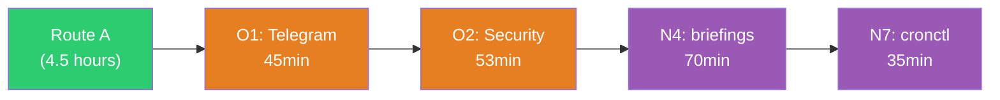
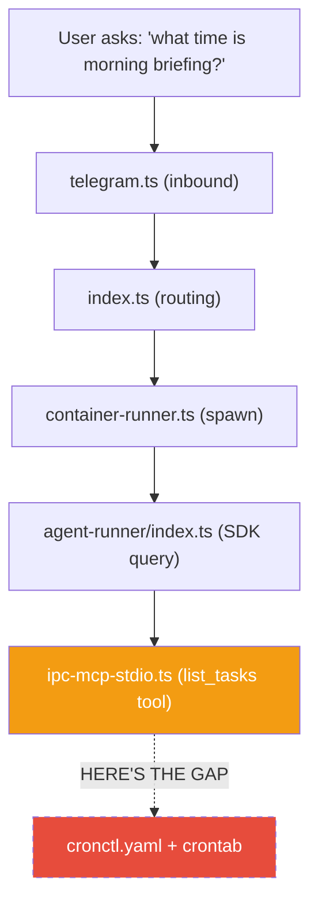

# 010 — Exploration Map

*2026-03-20 — The full map of the system, with time estimates and recommended routes*

## The Anatomy

The system has four structural layers, each containing subsystems of decreasing centrality. Think of it as a body:

```
SPINE (Tier 1)          — The three files everything flows through
SKELETON (Tier 2)       — The connective files wiring the spine together
ORGANS (Tier 3)         — Self-contained subsystems (channels, security, fleet)
NERVOUS SYSTEM (Tier 4) — The halos Python tooling ecosystem
```



```mermaid
flowchart TB
    subgraph T1["🦴 TIER 1 — Spine (~2,220 LOC)"]
        direction LR
        S1["src/index.ts\n755 LOC | 3,924+ churn"]
        S2["src/container-runner.ts\n833 LOC | 1,663+ churn"]
        S3["src/db.ts\n773 LOC | 832+ churn"]
    end

    subgraph T2["🔩 TIER 2 — Skeleton (~1,830 LOC)"]
        direction LR
        K1["types.ts\n108 LOC"]
        K2["config.ts\n94 LOC"]
        K3["ipc.ts\n465 LOC"]
        K4["group-queue.ts\n430 LOC"]
        K5["task-scheduler.ts\n282 LOC"]
        K6["router.ts\n52 LOC"]
        K7["agent-runner/index.ts\n657 LOC"]
        K8["ipc-mcp-stdio.ts\n338 LOC"]
    end

    subgraph T3["🫀 TIER 3 — Organs (~2,960 LOC)"]
        direction LR
        O1["Channels\ntelegram, gmail, registry"]
        O2["Security\nmount, creds, allowlist"]
        O3["Fleet & Personality\ntemplates, profiles"]
    end

    subgraph T4["🧠 TIER 4 — Nervous System (~17,200 LOC)"]
        direction LR
        N1["halctl\n4,321"]
        N2["nightctl\n2,452"]
        N3["memctl\n1,167"]
        N4["briefings\n818"]
        N5["logctl\n831"]
        N6["agentctl\n555"]
        N7["cronctl\n519"]
        N8["reportctl\n801"]
        N9["trackctl\n728"]
    end

    T1 --> T2
    T2 --> T3
    T3 --> T4
```

## Complete Inventory

### Tier 1: The Spine (3 files, ~2,220 LOC)

| # | File | LOC | Churn | Review | Walkthrough |
|---|------|-----|-------|--------|-------------|
| S1 | [`src/index.ts`](003-orchestrator.md) | 755 | 3,924+ | 45 min | [003](003-orchestrator.md) |
| S2 | [`src/container-runner.ts`](004-container-runner.md) | 833 | 1,663+ | 60 min | [004](004-container-runner.md) |
| S3 | [`src/db.ts`](005-data-layer.md) | 773 | 832+ | 38 min | [005](005-data-layer.md) |

**Subtotal: ~143 min (~2.4 hours)**

### Tier 2: The Skeleton (8 files, ~1,830 LOC)

| # | File | LOC | Review | Walkthrough |
|---|------|-----|--------|-------------|
| K1 | [`src/types.ts`](002-connective-tissue.md) | 108 | 8 min | [002](002-connective-tissue.md) |
| K2 | [`src/config.ts`](002-connective-tissue.md) | 94 | 6 min | [002](002-connective-tissue.md) |
| K3 | [`src/ipc.ts`](002-connective-tissue.md) | 465 | 25 min | [002](002-connective-tissue.md) |
| K4 | [`src/group-queue.ts`](002-connective-tissue.md) | 430 | 20 min | [002](002-connective-tissue.md) |
| K5 | [`src/task-scheduler.ts`](002-connective-tissue.md) | 282 | 15 min | [002](002-connective-tissue.md) |
| K6 | [`src/router.ts`](002-connective-tissue.md) | 52 | 5 min | [002](002-connective-tissue.md) |
| K7 | [`container/agent-runner/src/index.ts`](002-connective-tissue.md) | 657 | 30 min | [002](002-connective-tissue.md) |
| K8 | [`container/agent-runner/src/ipc-mcp-stdio.ts`](002-connective-tissue.md) | 338 | 18 min | [002](002-connective-tissue.md) |

**Subtotal: ~127 min (~2.1 hours)**

### Tier 3: Organs (5 subsystems, ~2,960 LOC)

| # | Subsystem | Files | LOC | Review | Walkthrough |
|---|-----------|-------|-----|--------|-------------|
| O1 | [Channels](006-channels.md) | telegram.ts, gmail.ts, registry.ts, index.ts | 981 | 85 min | [006](006-channels.md) |
| O2 | [Security](007-security.md) | mount-security.ts, credential-proxy.ts, sender-allowlist.ts, remote-control.ts | ~1,000 | 53 min | [007](007-security.md) |
| O3 | [Fleet & Personality](008-fleet-personality.md) | templates/, fleet-config.yaml, groups/ CLAUDE.md files | ~1,200 | 130 min | [008](008-fleet-personality.md) |

**Subtotal: ~268 min (~4.5 hours)**

### Tier 4: Nervous System — [Halos](009-halos-ecosystem.md) (8 modules, ~16,471 LOC)

| # | Module | LOC | Complexity | Review | Walkthrough |
|---|--------|-----|-----------|--------|-------------|
| N1 | [halctl](009-halos-ecosystem.md) | 4,321 | Complex | 120 min | [009](009-halos-ecosystem.md) |
| N2 | [nightctl](009-halos-ecosystem.md) | 2,452 | Complex | 110 min | [009](009-halos-ecosystem.md) |
| N3 | [memctl](009-halos-ecosystem.md) | 1,167 | Moderate | 80 min | [009](009-halos-ecosystem.md) |
| N4 | [briefings](009-halos-ecosystem.md) | 818 | Moderate | 70 min | [009](009-halos-ecosystem.md) |
| N5 | [logctl](009-halos-ecosystem.md) | 831 | Simple | 55 min | [009](009-halos-ecosystem.md) |
| N6 | [agentctl](009-halos-ecosystem.md) | 555 | Simple | 45 min | [009](009-halos-ecosystem.md) |
| N7 | [cronctl](009-halos-ecosystem.md) | 519 | Simple | 35 min | [009](009-halos-ecosystem.md) |
| N8 | [reportctl](009-halos-ecosystem.md) | 801 | Simple | 30 min | [009](009-halos-ecosystem.md) |
| N9 | [trackctl](009-halos-ecosystem.md) | 728 | Simple | 30 min | [009](009-halos-ecosystem.md) |

**Subtotal: ~575 min (~9.5 hours)**

## Grand Total

| Tier | LOC | Review Time |
|------|-----|-------------|
| 1 — Spine | 2,220 | 2.4 hours |
| 2 — Skeleton | 1,830 | 2.1 hours |
| 3 — Organs | 2,960 | 4.5 hours |
| 4 — Nervous System | ~17,200 | 9.5 hours |
| **Total** | **~24,200** | **~18.5 hours** |

(Remaining ~5,500 LOC is test files — review alongside their source, not separately.)

## Recommended Routes

### Route A: "Minimum Viable Understanding" (~4.5 hours)

For: Getting comfortable enough to debug most issues and make targeted changes.


Covers: [003 — Orchestrator](003-orchestrator.md), [004 — Container Runner](004-container-runner.md), [002 — Connective Tissue](002-connective-tissue.md), [005 — Data Layer](005-data-layer.md).

**What you gain:** Complete understanding of the message lifecycle, container spawning, data storage, and IPC protocol. You'll know how every message flows and where things can break.

**What you skip:** [Channels](006-channels.md) (how messages enter), [security](007-security.md) (how mounts are validated), [fleet](008-fleet-personality.md) (how instances are provisioned), [halos](009-halos-ecosystem.md) (the tooling ecosystem).

### Route B: "Operational Confidence" (~9 hours)

For: Understanding the full runtime, security model, and primary channel.



Route A + add:
```
  → O1 Telegram channel (45min)          → 006-channels.md
  → O2 Security model (53min)            → 007-security.md
  → N4 briefings (70min)                 → 009-halos-ecosystem.md
  → N7 cronctl (35min)                   → 009-halos-ecosystem.md
```

**What you gain:** You'll understand how [Telegram messages enter](006-channels.md), how [security boundaries](007-security.md) work, and — critically — the two scheduling systems (crontab vs nanoclaw tasks) that caused the briefing confusion.

### Route C: "Full Cartography" (~18 hours)

For: Complete system mastery. No dark corners.


Route B + add all remaining organs and [halos modules](009-halos-ecosystem.md), in this order:
```
  → O3 Fleet & Personality (130min)      → 008-fleet-personality.md
  → N1 halctl (120min)                   → 009-halos-ecosystem.md
  → N2 nightctl (110min)                 → 009-halos-ecosystem.md
  → N3 memctl (80min)                    → 009-halos-ecosystem.md
  → O1 Gmail channel (35min)             → 006-channels.md
  → N5 logctl (55min)                    → 009-halos-ecosystem.md
  → N6 agentctl (45min)                  → 009-halos-ecosystem.md
  → N8 reportctl (30min)                 → 009-halos-ecosystem.md
```

### Route D: "Incident-Driven" (variable)

For: Learning by tracing real failures.

Pick a recent incident (like the briefing confusion) and trace through every file it touches:



File-to-walkthrough mapping for the trace:
- [`telegram.ts`](006-channels.md) (inbound)
- [`index.ts`](003-orchestrator.md) (routing)
- [`container-runner.ts`](004-container-runner.md) (spawn)
- [`agent-runner/index.ts`](002-connective-tissue.md) (SDK query)
- [`ipc-mcp-stdio.ts`](002-connective-tissue.md) (list_tasks tool — the gap)
- [`cronctl`](009-halos-ecosystem.md) (where briefings actually live — agent doesn't know)

Each incident illuminates 3-5 files with concrete motivation. ~1-2 hours per incident, but the understanding is deeply anchored.

## Session Planning

With pair-programming walkthrough sessions (you reading, me riding shotgun):

| Session | Focus | Duration | Route | Walkthrough |
|---------|-------|----------|-------|-------------|
| 1 | Spine: index.ts deep read | 45-60 min | S1 | [003](003-orchestrator.md) |
| 2 | Spine: container-runner.ts | 60-75 min | S2 | [004](004-container-runner.md) |
| 3 | Container side: agent-runner + IPC-MCP | 50-60 min | K7 + K8 | [002](002-connective-tissue.md) |
| 4 | Data & scheduling: db.ts + task-scheduler + ipc.ts | 60-75 min | S3 + K5 + K3 | [005](005-data-layer.md), [002](002-connective-tissue.md) |
| 5 | Traffic: group-queue + config + types + router | 40-50 min | K4 + K2 + K1 + K6 | [002](002-connective-tissue.md) |
| 6 | Telegram channel deep read | 45-60 min | O1 (Telegram only) | [006](006-channels.md) |
| 7 | Security model walkthrough | 50-60 min | O2 | [007](007-security.md) |
| 8 | Briefings + cronctl (closing the gap) | 60-75 min | N4 + N7 | [009](009-halos-ecosystem.md) |

That's 8 sessions covering Route B. Each is a natural stopping point. After each, you'll know one more subsystem well enough to navigate independently.

## How to Use This Map

1. **Before a session:** Read the walkthrough entry for context. The entry gives you the structural overview so you're not reading the code cold.

2. **During a session:** Open the source file alongside the walkthrough. The walkthrough tells you where to focus; the code tells you what it actually does.

3. **After a session:** Use `/walkthrough-add` to record anything the walkthrough missed or got wrong. This is a living document.

4. **When debugging:** Check the exploration map for which files are involved. If you understand the relevant tier, you can reason about the problem. If not, that's your next session.

## See also

- [001 — Codebase Census](001-codebase-census.md) — LOC counts, churn heatmap, ROI tiers
- [002 — Connective Tissue](002-connective-tissue.md) — Tier 2 wiring: IPC, group queue, config, types, router
- [003 — Orchestrator](003-orchestrator.md) — Deep dive into `src/index.ts`
- [004 — Container Runner](004-container-runner.md) — Container spawning mechanics
- [005 — Data Layer](005-data-layer.md) — SQLite schema and `db.ts`
- [006 — Channels](006-channels.md) — Telegram, Gmail, and the registry
- [007 — Security](007-security.md) — Five-layer security model
- [008 — Fleet & Personality](008-fleet-personality.md) — Fleet provisioning and templates
- [009 — Halos Ecosystem](009-halos-ecosystem.md) — Python tooling modules
